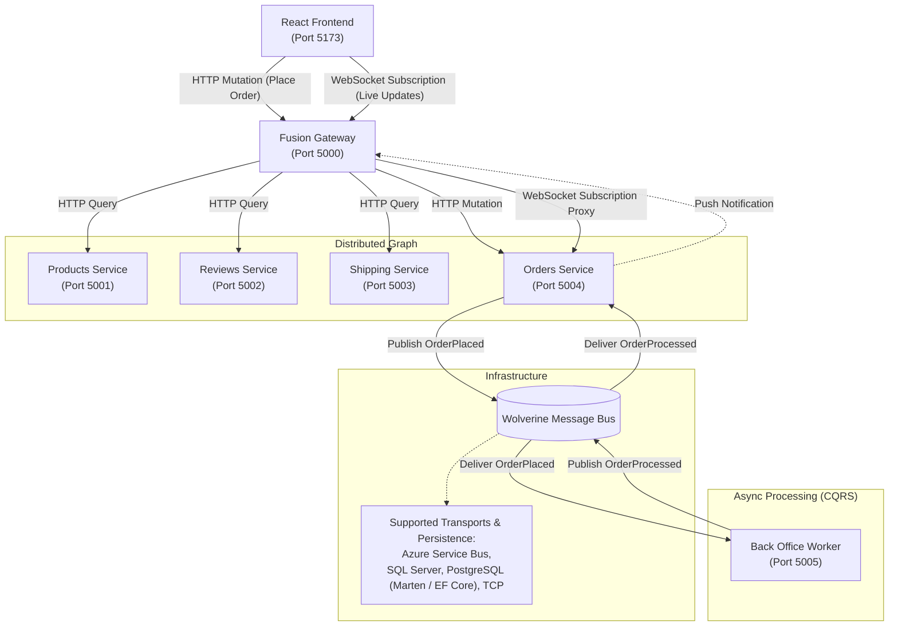
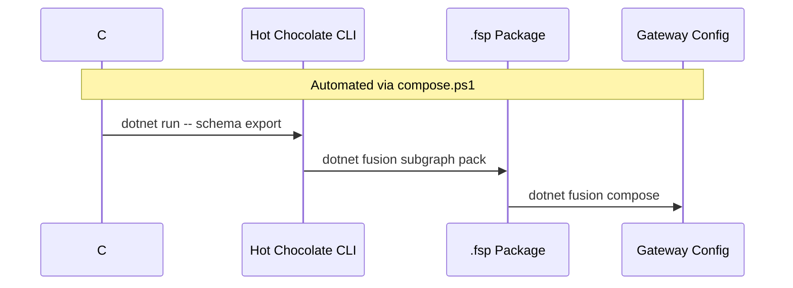
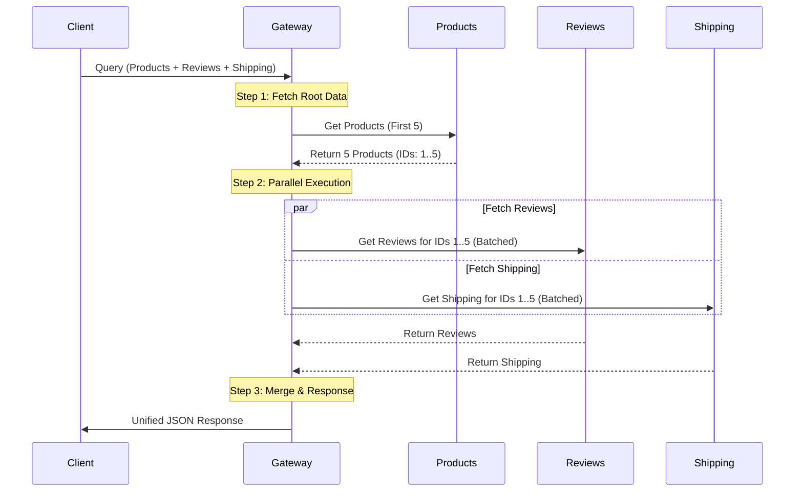
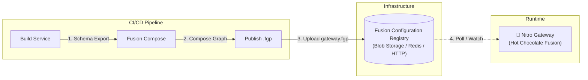

# GraphQL Gateway with Hot Chocolate Fusion

This solution demonstrates a modern **Hot Chocolate Fusion** architecture that aggregates multiple native GraphQL services into a single, unified distributed graph.

Unlike traditional API gateways that manually map REST endpoints, this solution uses a **declarative composition** approach where independent GraphQL subgraphs are "fused" together.

## 🏗️ Architecture

The system consists of a central **Fusion Gateway**, four downstream **GraphQL Subgraphs**, a **Back Office Worker**, and a **React Frontend**.



### Service Inventory

| Service | Port | Type | Description |
|---------|------|------|-------------|
| **Gateway** | `5000` | Fusion | The entry point. Handles query planning and execution across subgraphs. Proxies WebSockets for real-time updates. |
| **Products** | `5001` | Subgraph | Manages product catalog data. |
| **Reviews** | `5002` | Subgraph | Manages customer reviews and ratings. |
| **Shipping** | `5003` | Subgraph | Calculates shipping costs and delivery estimates. |
| **Orders** | `5004` | Subgraph | Handles order placement (Mutation) and pushes real-time status updates (Subscription). |
| **BackOffice** | `N/A` | Worker | Asynchronously processes orders and publishes events. |
| **Frontend** | `5173` | React | Modern UI for browsing products and placing orders. |

---

## 🚀 CQRS & Event-Driven Architecture

This solution implements a **CQRS (Command Query Responsibility Segregation)** pattern using **Wolverine** as the in-memory service bus (which can be swapped for durable brokers).

### Workflow
1.  **Command**: The Frontend sends a `placeOrder` mutation to the **Gateway**, which routes it to the **Orders Service**.
2.  **Dispatch**: The `Orders Service` saves the order as "Placed" and publishes an `OrderPlaced` event via **Wolverine**.
3.  **Async Processing**: The **Back Office Service** (a background worker) listens for `OrderPlaced`. It simulates processing (e.g., payment, inventory) and then publishes an `OrderProcessed` event.
4.  **Reaction**: The `Orders Service` listens for `OrderProcessed`, updates the order status to "Processed", and publishes a GraphQL Subscription update (`OnOrderUpdated`).
5.  **Notification**: The Frontend receives the subscription update via **WebSockets** (proxied through the Gateway) and displays a toast notification.

> **Note on Real-Time Updates**: The `OrdersService` exposes a GraphQL Subscription endpoint. The Fusion Gateway automatically detects this and sets up a WebSocket proxy. When the `OrdersService` publishes an event, it travels: `OrdersService` -> `Gateway` -> `React Frontend`.

### Wolverine Capabilities
We use **Wolverine** for message routing and handling. While this demo uses TCP/In-Memory transport for simplicity, Wolverine supports enterprise-grade infrastructure:

*   **Transports (Brokers)**:
    *   Azure Service Bus
    *   Amazon SQS
    *   RabbitMQ
    *   TCP (Direct)
    *   In-Memory (Local)
*   **Persistence (Transactional Outbox)**:
    *   PostgreSQL (via Marten)
    *   SQL Server
    *   Entity Framework Core

This allows the architecture to scale from a simple local development setup to a robust, durable, cloud-native distributed system with minimal code changes.

---

## 🌟 Key Features

### 1. Pure GraphQL Architecture
All services are built as native GraphQL servers using **Hot Chocolate**. There are no REST dependencies or OpenAPI mappings. This ensures a consistent type system and query language across the entire stack.

### 2. Code-First Schema Definition
Schemas are defined purely in C# code. The GraphQL SDL (Schema Definition Language) is automatically generated from the C# models and logic.

### 3. Advanced Data Capabilities
Every service implements the full suite of Hot Chocolate Data capabilities:
*   **Filtering**: `[UseFiltering]` allows complex `where` clauses (e.g., `price: { gt: 100 }`).
*   **Sorting**: `[UseSorting]` allows multi-field ordering (e.g., `order: { price: DESC }`).
*   **Pagination**: `[UsePaging]` implements standard Relay-style cursor pagination.

---

## 🛠️ Development Workflow

This project uses an automated workflow to keep the Gateway in sync with the Subgraphs.

### The Composition Pipeline

The `compose.ps1` script automates the entire lifecycle:

1.  **Schema Export**: Runs each service to generate the latest `.graphql` SDL files from C# code.
2.  **Subgraph Packing**: Packs each SDL and its configuration into a `.fsp` (Fusion Subgraph Package).
3.  **Gateway Composition**: Merges all `.fsp` files into a single `gateway.fgp` (Fusion Gateway Package).



### Directory Structure

*   `src/Gateway/`: The Fusion Gateway server.
*   `src/ProductsService/`: Product catalog subgraph.
*   `src/ReviewsService/`: Review management subgraph.
*   `src/ShippingService/`: Shipping calculation subgraph.
*   `src/schemas/`: Artifacts for composition (generated SDLs, configs, packages).

---

## 🧠 How It Works: The Query Plan

In a distributed GraphQL architecture like Hot Chocolate Fusion, the Gateway is not just a proxy; it is a sophisticated query engine. When a client sends a request, the Gateway compiles a **Query Plan**—a calculated strategy for how to fetch the data most efficiently from your downstream services.

### 1. The Life of a Request

#### Phase 1: Analysis & Decomposition
The Gateway analyzes the incoming query against the **Fusion Configuration (`gateway.fgp`)**. It breaks the query down into "selection sets" based on which subgraph owns which data.

#### Phase 2: Dependency Resolution
The planner builds a **Dependency Graph**.
*   **Root**: Fetch `products` from **Products Service**.
*   **Dependents**: Fetch `reviews` and `shipping` (which require the `Product.id` from the root).

#### Phase 3: Execution Plan Construction
The Gateway creates an execution tree. It recognizes that once it has the Product ID, the requests for *Reviews* and *Shipping* are independent of each other and schedules them to run **in parallel**.

### 2. Automatic Optimizations

Fusion applies several powerful optimizations automatically:

#### A. The "N+1" Problem Solver (Request Batching)
*   **Scenario**: You request 10 products, and for *each* product, you want its shipping cost.
*   **Fusion Approach**:
    1.  Fetch 10 products (1 request).
    2.  Fusion collects all 10 Product IDs.
    3.  It sends a **single batched request** to the Shipping Service: "Give me shipping for these 10 IDs."
    *   **Result**: 2 requests instead of 11.

#### B. Selection Set Pruning (Over-fetching Protection)
The Gateway is precise. If your client asks for `{ name price }`, but the service exposes `{ name price description stock }`, the Gateway rewrites the downstream query to ask *only* for `name` and `price`.

#### C. Argument Forwarding (Push-Down)
When you use `[UseFiltering]` or `[UseSorting]`, the Gateway does *not* fetch all data and filter in memory. Instead, it **forwards the `where` clause** directly to the downstream service, letting the database do the heavy lifting.

#### D. Parallel Execution
Any sub-queries that do not depend on each other are executed concurrently. While the **Reviews Service** is calculating star ratings, the **Shipping Service** is simultaneously calculating delivery dates.

### 3. Visualizing the Plan



---

## 🚀 Getting Started

### Prerequisites
*   .NET 8.0 or later (Project targets .NET 10 Preview)
*   Hot Chocolate CLI tools (installed automatically via local tools or global)

### One-Click Run
Use the provided PowerShell script to build, compose, and start all services:

```powershell
cd src
./start-all.ps1
```

This will:
1.  Compile all projects.
2.  Generate fresh schemas.
3.  Compose the Fusion Gateway configuration.
4.  Launch all 4 services in separate processes.
5.  Open the Gateway Playground in your default browser.

### Manual Composition
If you make changes to the C# code (e.g., adding a field), you must regenerate the gateway configuration:

```powershell
cd src
./compose.ps1
```

---

## 🔍 Example Queries

Once the solution is running, open `http://localhost:5000/graphql` and try these queries.

### 1. The "Everything" Query
Fetch products with their related reviews and shipping options, applying filtering and sorting at multiple levels.

```graphql
query GetRichProductData {
  products(first: 5, order: { price: DESC }) {
    nodes {
      name
      price
      description
      
      # Filter reviews to only show 4+ stars
      reviews(where: { starRating: { gte: 4 } }, order: { starRating: DESC }) {
        totalCount
        nodes {
          starRating
          content
        }
      }
      
      # Get shipping options under $20
      shipping(where: { cost: { lt: 20 } }) {
        nodes {
          carrier
          cost
          estimatedDays
        }
      }
    }
  }
}
```

### 2. Deep Filtering
Find products that have specific shipping options available.

```graphql
query FindFastShippingProducts {
  products(
    where: { 
      shipping: { 
        some: { 
          estimatedDays: { lte: 2 } 
        } 
      } 
    }
  ) {
    nodes {
      name
      shipping(where: { estimatedDays: { lte: 2 } }) {
        nodes {
          carrier
          estimatedDays
        }
      }
    }
  }
}
```

# Dynamic Fusion Gateway (Nitro) Integration Design

---

## 🔗 Distributed Data Graph (Type Merging)

One of the most powerful features of Hot Chocolate Fusion is **Type Merging**. This allows you to define a type (like `Product`) in multiple subgraphs and have the Gateway automatically merge them into a single, unified type.

This is how we allow querying `Product` details directly from an `Order`, even though the `OrdersService` database only stores the `ProductId`.

### How it works

1.  **The Source of Truth (`ProductsService`)**:
    The `ProductsService` defines the full `Product` type and provides a **Node Resolver** to look it up by ID.
    ```csharp
    // ProductsService/Product.cs
    public record Product([property: ID] string Id, string Name, double Price, string Description);

    // ProductsService/Query.cs
    [NodeResolver]
    public Product? GetProduct(string id) => _products.FirstOrDefault(p => p.Id == id);
    ```

2.  **The Reference (`OrdersService`)**:
    The `OrdersService` defines a "stub" `Product` type that only contains the `Id`. It exposes this as a property on the `Order`.
    ```csharp
    // OrdersService/Models/Order.cs
    public record Order(string Id, string ProductId, ...)
    {
        // 🔗 This creates the link!
        public Product Product => new Product(ProductId);
    }

    // OrdersService/Models/Product.cs
    public record Product([property: ID] string Id);
    ```

3.  **The Fusion Magic**:
    When you query `order { product { name } }`:
    1.  The Gateway fetches the `Order` from `OrdersService`.
    2.  It gets the `Product` object (which only has an `Id`).
    3.  It sees that `Product` is also defined in `ProductsService` and has a `name` field.
    4.  It automatically calls the `ProductsService`'s Node Resolver using that `Id` to fetch the `name`.

### Example Query

```graphql
query GetOrdersWithProductDetails {
  orders {
    nodes {
      id
      status
      quantity
      
      # 🔗 Cross-service join happens here!
      product {
        name
        price
        description
        
        # You can even go deeper!
        reviews {
          nodes {
            starRating
          }
        }
      }
    }
  }
}
```

# Dynamic Fusion Gateway (Nitro) Integration Design

This document outlines the architecture and steps required to upgrade our current static Fusion Gateway to a **Dynamic "Nitro" Gateway** that supports live schema updates without downtime.

## 🎯 Objective
Enable a **Zero-Downtime Deployment** workflow where:
1.  Subgraphs (Products, Orders, etc.) can be deployed independently.
2.  Schema changes are automatically composed and pushed to the Gateway.
3.  The Gateway (running the Nitro engine) detects the new configuration and hot-reloads instantly.

## 🏗️ Architecture

We will transition from a "Build-Time Composition" (current) to a "Publish-Time Composition" model.



## 🛠️ Implementation Plan

### 1. The Registry (Configuration Store)
Instead of baking `gateway.fgp` into the Gateway's Docker image, we will store it externally.
*   **Local Dev**: A shared folder or watched file.
*   **Production**: Azure Blob Storage, AWS S3, or a Redis instance.

### 2. CI/CD Pipeline Updates
We need a pipeline that runs whenever a subgraph changes:

```bash
# 1. Install Fusion CLI
dotnet tool install -g HotChocolate.Fusion.CommandLine

# 2. Pack the modified subgraph (e.g., Orders)
dotnet fusion subgraph pack -w src -s schemas/orders.graphql -c schemas/orders-config.json -p schemas/orders.fsp

# 3. Re-compose the full Gateway package
dotnet fusion compose -p gateway.fgp -s schemas/*.fsp

# 4. Push/Upload the new gateway.fgp to the Registry
# (Example: Upload to Azure Blob Storage)
az storage blob upload -f gateway.fgp -c fusion-config -n gateway.fgp --overwrite
```

### 3. Gateway Configuration (Nitro)
Update the Gateway's `Program.cs` to load the configuration from the external source and watch for changes.

#### Option A: File Watcher (Simplest / Kubernetes Volume)
If using Kubernetes, you can mount the `.fgp` as a ConfigMap or Volume. The Gateway watches the file system.

```csharp
// src/Gateway/Program.cs
var builder = WebApplication.CreateBuilder(args);

builder.Services
    .AddFusionGatewayServer()
    .ConfigureFromFile("./config/gateway.fgp", watchFile: true); // 👈 Enables Hot Reload

var app = builder.Build();
app.MapGraphQL();
app.Run();
```

#### Option B: HTTP Polling / Blob Storage
For cloud-native setups, implement a `IConfiguration` source or use a background service to poll the blob storage and update the configuration.

```csharp
// src/Gateway/Program.cs
builder.Services
    .AddFusionGatewayServer()
    .ConfigureFromCloud(
        connectionString: builder.Configuration["Fusion:RegistryConnection"], 
        graphName: "my-graph",
        watch: true
    );
```
*(Note: `ConfigureFromCloud` would be part of the managed Bananacakepop platform or a custom implementation wrapping the `FusionGraphConfiguration`)*.

## 🚀 Deployment Strategy

1.  **Deploy Gateway**: Deploy the Gateway service once. It starts up and waits for a valid configuration.
2.  **Deploy Subgraph**: Deploy a new version of `OrdersService`.
3.  **Publish Schema**: The CI pipeline detects the change, re-composes, and overwrites `gateway.fgp` in the Registry.
4.  **Hot Reload**: The Gateway detects the change (via file watch or poll), creates a new execution engine in the background, and atomically swaps it. In-flight requests complete on the old version; new requests use the new version.

## ✅ Benefits
*   **Decoupling**: Subgraph teams can release independently.
*   **Resilience**: If composition fails, the Gateway keeps running the last known good configuration.
*   **Speed**: No need to restart the Gateway container/pod.

## 💻 Local Development Implementation

For local development, we have implemented a custom `FusionReloadService` that watches the `gateway.fgp` file for changes.

### How it works
1.  **FusionReloadService**: A `BackgroundService` that uses `FileSystemWatcher` to monitor `gateway.fgp`.
2.  **Event Handling**: When the file changes, the service waits briefly (debounce) to ensure the write is complete.
3.  **Eviction**: It calls `IRequestExecutorResolver.EvictRequestExecutor("Fusion")` to invalidate the current schema.
4.  **Reload**: The next request to the Gateway triggers a fresh load of the configuration from the file.

### Code Reference
-   `src/Gateway/FusionReloadService.cs`: The file watcher implementation.
-   `src/Gateway/Program.cs`: Registration of the hosted service.

```csharp
// src/Gateway/Program.cs
builder.Services.AddHostedService<Gateway.FusionReloadService>();
```
