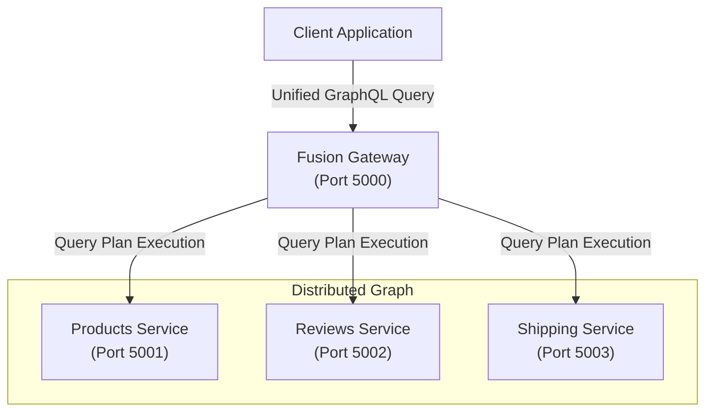
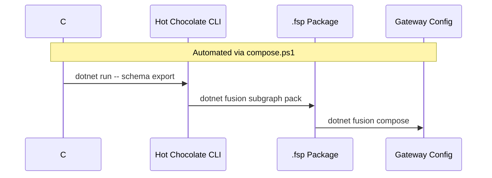
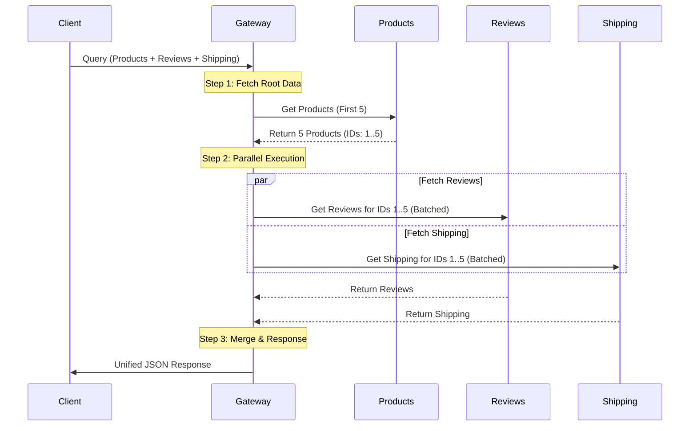

# GraphQL Gateway with Hot Chocolate Fusion

This solution demonstrates a modern **Hot Chocolate Fusion** architecture that aggregates multiple native GraphQL services into a single, unified distributed graph.

Unlike traditional API gateways that manually map REST endpoints, this solution uses a **declarative composition** approach where independent GraphQL subgraphs are "fused" together.

## 🏗️ Architecture

The system consists of a central **Fusion Gateway** and three downstream **GraphQL Subgraphs**.



### Service Inventory

| Service | Port | Type | Description |
|---------|------|------|-------------|
| **Gateway** | `5000` | Fusion | The entry point. Handles query planning and execution across subgraphs. |
| **Products** | `5001` | Subgraph | Manages product catalog data. |
| **Reviews** | `5002` | Subgraph | Manages customer reviews and ratings. |
| **Shipping** | `5003` | Subgraph | Calculates shipping costs and delivery estimates. |

---

## 🌟 Key Features

### 1. Pure GraphQL Architecture
All services are built as native GraphQL servers using **Hot Chocolate**. There are no REST dependencies or OpenAPI mappings. This ensures a consistent type system and query language across the entire stack.

### 2. Code-First Schema Definition
Schemas are defined purely in C# code. The GraphQL SDL (Schema Definition Language) is automatically generated from the C# models and logic.

### 3. Advanced Data Capabilities
Every service implements the full suite of Hot Chocolate Data capabilities:
*   **Filtering**: `[UseFiltering]` allows complex `where` clauses (e.g., `price: { gt: 100 }`).
*   **Sorting**: `[UseSorting]` allows multi-field ordering (e.g., `order: { price: DESC }`).
*   **Pagination**: `[UsePaging]` implements standard Relay-style cursor pagination.

---

## 🛠️ Development Workflow

This project uses an automated workflow to keep the Gateway in sync with the Subgraphs.

### The Composition Pipeline

The `compose.ps1` script automates the entire lifecycle:

1.  **Schema Export**: Runs each service to generate the latest `.graphql` SDL files from C# code.
2.  **Subgraph Packing**: Packs each SDL and its configuration into a `.fsp` (Fusion Subgraph Package).
3.  **Gateway Composition**: Merges all `.fsp` files into a single `gateway.fgp` (Fusion Gateway Package).



### Directory Structure

*   `src/Gateway/`: The Fusion Gateway server.
*   `src/ProductsService/`: Product catalog subgraph.
*   `src/ReviewsService/`: Review management subgraph.
*   `src/ShippingService/`: Shipping calculation subgraph.
*   `src/schemas/`: Artifacts for composition (generated SDLs, configs, packages).

---

## 🧠 How It Works: The Query Plan

In a distributed GraphQL architecture like Hot Chocolate Fusion, the Gateway is not just a proxy; it is a sophisticated query engine. When a client sends a request, the Gateway compiles a **Query Plan**—a calculated strategy for how to fetch the data most efficiently from your downstream services.

### 1. The Life of a Request

#### Phase 1: Analysis & Decomposition
The Gateway analyzes the incoming query against the **Fusion Configuration (`gateway.fgp`)**. It breaks the query down into "selection sets" based on which subgraph owns which data.

#### Phase 2: Dependency Resolution
The planner builds a **Dependency Graph**.
*   **Root**: Fetch `products` from **Products Service**.
*   **Dependents**: Fetch `reviews` and `shipping` (which require the `Product.id` from the root).

#### Phase 3: Execution Plan Construction
The Gateway creates an execution tree. It recognizes that once it has the Product ID, the requests for *Reviews* and *Shipping* are independent of each other and schedules them to run **in parallel**.

### 2. Automatic Optimizations

Fusion applies several powerful optimizations automatically:

#### A. The "N+1" Problem Solver (Request Batching)
*   **Scenario**: You request 10 products, and for *each* product, you want its shipping cost.
*   **Fusion Approach**:
    1.  Fetch 10 products (1 request).
    2.  Fusion collects all 10 Product IDs.
    3.  It sends a **single batched request** to the Shipping Service: "Give me shipping for these 10 IDs."
    *   **Result**: 2 requests instead of 11.

#### B. Selection Set Pruning (Over-fetching Protection)
The Gateway is precise. If your client asks for `{ name price }`, but the service exposes `{ name price description stock }`, the Gateway rewrites the downstream query to ask *only* for `name` and `price`.

#### C. Argument Forwarding (Push-Down)
When you use `[UseFiltering]` or `[UseSorting]`, the Gateway does *not* fetch all data and filter in memory. Instead, it **forwards the `where` clause** directly to the downstream service, letting the database do the heavy lifting.

#### D. Parallel Execution
Any sub-queries that do not depend on each other are executed concurrently. While the **Reviews Service** is calculating star ratings, the **Shipping Service** is simultaneously calculating delivery dates.

### 3. Visualizing the Plan



---

## 🚀 Getting Started

### Prerequisites
*   .NET 8.0 or later (Project targets .NET 10 Preview)
*   Hot Chocolate CLI tools (installed automatically via local tools or global)

### One-Click Run
Use the provided PowerShell script to build, compose, and start all services:

```powershell
cd src
./start-all.ps1
```

This will:
1.  Compile all projects.
2.  Generate fresh schemas.
3.  Compose the Fusion Gateway configuration.
4.  Launch all 4 services in separate processes.
5.  Open the Gateway Playground in your default browser.

### Manual Composition
If you make changes to the C# code (e.g., adding a field), you must regenerate the gateway configuration:

```powershell
cd src
./compose.ps1
```

---

## 🔍 Example Queries

Once the solution is running, open `http://localhost:5000/graphql` and try these queries.

### 1. The "Everything" Query
Fetch products with their related reviews and shipping options, applying filtering and sorting at multiple levels.

```graphql
query GetRichProductData {
  products(first: 5, order: { price: DESC }) {
    nodes {
      name
      price
      description
      
      # Filter reviews to only show 4+ stars
      reviews(where: { starRating: { gte: 4 } }, order: { starRating: DESC }) {
        totalCount
        nodes {
          starRating
          content
        }
      }
      
      # Get shipping options under $20
      shipping(where: { cost: { lt: 20 } }) {
        nodes {
          carrier
          cost
          estimatedDays
        }
      }
    }
  }
}
```

### 2. Deep Filtering
Find products that have specific shipping options available.

```graphql
query FindFastShippingProducts {
  products(
    where: { 
      shipping: { 
        some: { 
          estimatedDays: { lte: 2 } 
        } 
      } 
    }
  ) {
    nodes {
      name
      shipping(where: { estimatedDays: { lte: 2 } }) {
        nodes {
          carrier
          estimatedDays
        }
      }
    }
  }
}
```

