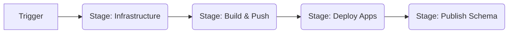

# Azure DevOps Deployment Pipeline Plan

This document outlines a comprehensive strategy for migrating the current local PowerShell-based deployment (`deploy.ps1`) to a modular, controlled Azure DevOps pipeline.

## 1. Design Philosophy

The goal is to "reuse what we have" while gaining the granular control and visibility provided by Azure DevOps. Instead of running the monolithic `deploy.ps1` inside the pipeline, we will decompose its steps into distinct **Stages** and **Jobs** in the YAML pipeline. This allows:
- **Partial Deployments**: Run only "Build" or only "Schema Publish" if needed.
- **Approval Gates**: Require manual approval before promoting to Production.
- **Parallelism**: Build multiple docker images simultaneously.
- **Traceability**: See exactly which step failed.

## 2. Pipeline Architecture

The pipeline will be divided into 4 major stages:

1.  **Infrastructure (IaC)**: Provisions Azure resources (ACA Environment, Postgres, Registry) using Bicep.
2.  **Build & Push**: Builds Docker images for all services and pushes them to Azure Container Registry (ACR).
3.  **Deploy Services**: Updates the Container Apps with the new image tags.
4.  **Gateway Configuration**: Composes the subgraph schemas and publishes the Fusion configuration.

### Flow Diagram


## 3. Detailed Implementation Plan

### Prerequisites
- **Azure Service Connection**: An ARM Service Connection in Azure DevOps to authorize deployments.
- **Variable Group**: Store secrets (e.g., `NitroAdminToken`, `PostgresPassword`) securely in Azure DevOps Library.

### Stage 1: Infrastructure (Provisioning)
*Reuse Target*: `infra/main.bicep` (via `azd` or `az deployment`)

Instead of running `deploy.ps1 -Step Provision`, we will use the **Azure CLI** task.
- **Action**: Run `az deployment sub create` pointing to `deployment/alderaan/infra/main.bicep`.
- **Why**: Gives direct control over parameters and outputs without the overhead of the full `azd` wrapper script, though `azd` can also be installed on agents.
- **Control**: Can be skipped if infrastructure is stable.

### Stage 2: Build & Push
*Reuse Target*: `deployment/alderaan/scripts/build-images.ps1`

We can reuse the logic in `build-images.ps1` but execute it within an **Azure CLI** task (to get ACR login context) or use standard **Docker** tasks.
- **Recommendation**: Use the existing PowerShell script initially to maintain logic parity with local development.
- **Optimization**: Later, split this into a matrix strategy to build `Orders`, `Products`, etc., in parallel jobs.

### Stage 3: Deploy Services
*Reuse Target*: `deployment/alderaan/deploy.ps1` (logic for app deployment)

This stage updates the Container Apps.
- **Action**: Use `az containerapp update` commands.
- **Strategy**: We can generate a small script or use a Bicep deployment specifically for the app containers (referencing the images built in Stage 2).
- **Versioning**: Pass the `$(Build.BuildId)` as the image tag to ensure we deploy exactly what we built.

### Stage 4: Publish Schema
*Reuse Target*: `deployment/alderaan/scripts/publish-fgp.ps1`

This is critical for the Gateway to function.
- **Action**: Install `fusion` CLI on the agent (or use a docker container with it).
- **Steps**:
    1. Run `dotnet tool install -g HotChocolate.Fusion.CommandLine`.
    2. Execute `publish-fgp.ps1`.
- **Control**: This step can be gated or triggered manually if you want to deploy code but not switch traffic/schema yet.

## 4. Proposed YAML Structure (`azure-pipelines.yml`)

```yaml
trigger:
  - main

variables:
  - group: 'aca-variable-group' # Contains Secrets
  - name: location
    value: 'northeurope'
  - name: environmentName
    value: 'alderaan-prod'
  - name: acrName
    value: 'acrgraphqlaca' # Needs to be dynamic or fixed

stages:
  # ------------------------------------------------------------------
  # STAGE 1: INFRASTRUCTURE
  # ------------------------------------------------------------------
  - stage: Infrastructure
    displayName: 'Provision Infrastructure'
    jobs:
      - job: Provision
        pool:
          vmImage: 'ubuntu-latest'
        steps:
          - task: AzureCLI@2
            inputs:
              azureSubscription: 'MyServiceConnection'
              scriptType: 'pscore'
              scriptLocation: 'inlineScript'
              inlineScript: |
                # Option A: Use azd if available/installed
                # Option B: Direct Bicep deployment (Recommended for control)
                az deployment sub create `
                  --location $(location) `
                  --template-file deployment/alderaan/infra/main.bicep `
                  --parameters environmentName=$(environmentName)

  # ------------------------------------------------------------------
  # STAGE 2: BUILD & PUSH
  # ------------------------------------------------------------------
  - stage: Build
    displayName: 'Build & Push Images'
    dependsOn: Infrastructure
    jobs:
      - job: BuildImages
        pool:
          vmImage: 'ubuntu-latest'
        steps:
          - task: AzureCLI@2
            displayName: 'Run Build Script'
            inputs:
              azureSubscription: 'MyServiceConnection'
              scriptType: 'pscore'
              scriptPath: 'deployment/alderaan/scripts/build-images.ps1'
              arguments: '-ImageTag $(Build.BuildId) -Push'

  # ------------------------------------------------------------------
  # STAGE 3: DEPLOY APPS
  # ------------------------------------------------------------------
  - stage: Deploy
    displayName: 'Deploy Container Apps'
    dependsOn: Build
    jobs:
      - job: DeployApps
        pool:
          vmImage: 'ubuntu-latest'
        steps:
          - task: AzureCLI@2
            inputs:
              azureSubscription: 'MyServiceConnection'
              scriptType: 'pscore'
              scriptLocation: 'inlineScript'
              inlineScript: |
                # Example for one service, loop for others or use script
                az containerapp update `
                  --name orders-service `
                  --resource-group rg-$(environmentName) `
                  --image $(acrName).azurecr.io/orders-service:$(Build.BuildId)

  # ------------------------------------------------------------------
  # STAGE 4: PUBLISH SCHEMA
  # ------------------------------------------------------------------
  - stage: Schema
    displayName: 'Publish Fusion Schema'
    dependsOn: Deploy
    jobs:
      - job: PublishFGP
        pool:
          vmImage: 'ubuntu-latest'
        steps:
          - script: dotnet tool install -g HotChocolate.Fusion.CommandLine
            displayName: 'Install Fusion CLI'
          
          - task: AzureCLI@2
            inputs:
              azureSubscription: 'MyServiceConnection'
              scriptType: 'pscore'
              scriptPath: 'deployment/alderaan/scripts/publish-fgp.ps1'
              arguments: '-Environment $(environmentName)'
```

## 5. Next Steps

1.  **Create Service Connection**: Set up the connection to your Azure Subscription in ADO Project Settings.
2.  **Create Variable Group**: Create `aca-variable-group` with `PostgresPassword`, `NitroAdminToken`.
3.  **Commit YAML**: Add the YAML above to `azure-pipelines.yml` in the root.
4.  **Refactor Scripts**: Ensure `build-images.ps1` and `publish-fgp.ps1` can accept parameters cleanly from the pipeline (they seem ready).
