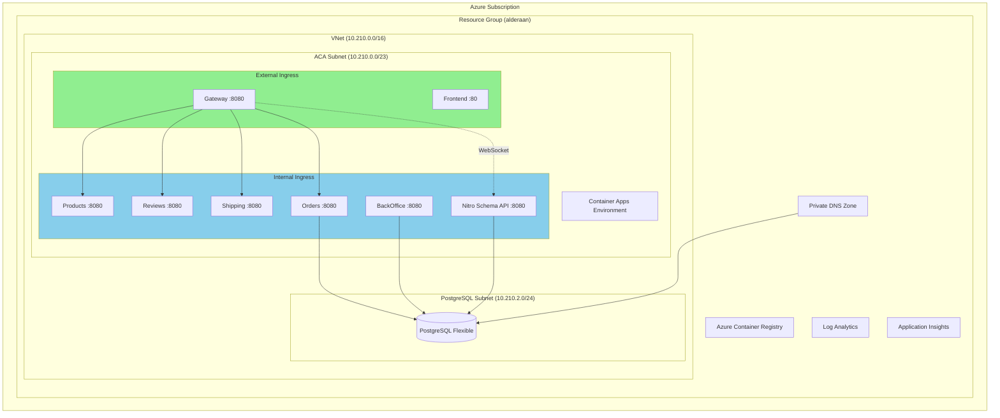
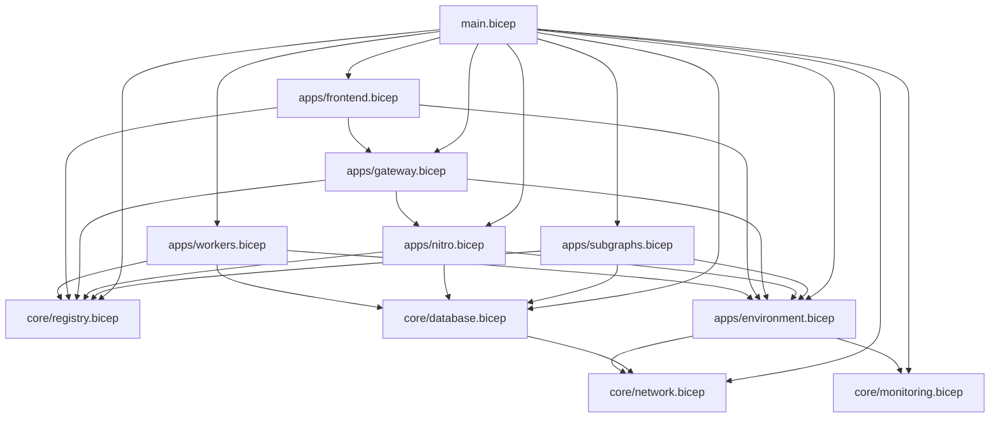
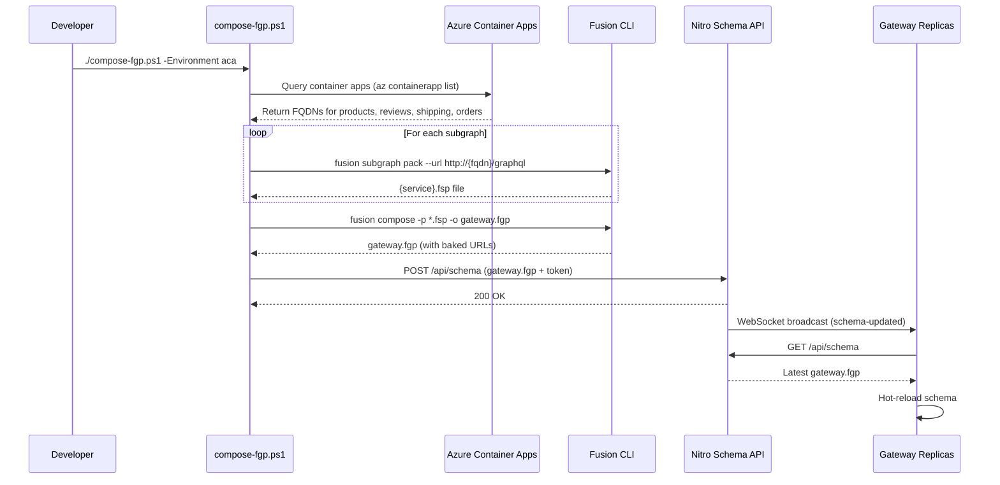

# Azure Container Apps Deployment Guide

Modern deployment guide for the GraphQL Gateway Patterns project using **Azure Developer CLI (azd)** with layered **Bicep modules** and environment-specific **JSON parameter files**.

---

## Table of Contents

1. [Architecture Overview](#architecture-overview)
2. [Current State Analysis](#current-state-analysis)
3. [Modern AZD + Bicep Structure](#modern-azd--bicep-structure)
4. [Layered Bicep Module Design](#layered-bicep-module-design)
5. [Environment-Specific Parameters](#environment-specific-parameters)
6. [Container Apps Configuration](#container-apps-configuration)
7. [Migration Steps](#migration-steps)
8. [CI/CD Integration](#cicd-integration)

---

## Architecture Overview



---

## Current State Analysis

### Current Structure (`deployment/aca-test1/`)

| File | Purpose | Issues |
|------|---------|--------|
| `main.bicep` | Subscription-scoped entry point | ✅ Good structure |
| `resources.bicep` | All resources in single file | ⚠️ Monolithic, hard to maintain |
| `main.parameters.json` | Single param file | ⚠️ Contains secrets in plain text |
| `provision.ps1` | Deploys infrastructure | ✅ Simple |
| `deploy-images.ps1` | Builds & pushes Docker images | ⚠️ Manual process |
| `deploy-containerapps.ps1` | Creates/updates Container Apps | ⚠️ Imperative CLI commands, not declarative |

### Key Issues to Address

1. **Monolithic Bicep** - All resources in one file
2. **Imperative Container Apps** - Using `az containerapp create` instead of declarative Bicep
3. **Secrets in Parameters** - Postgres password in `main.parameters.json`
4. **No AZD Integration** - Manual deployment workflow
5. **No Environment Separation** - Same params for dev/staging/prod
6. **No Container Apps Bicep** - Container Apps created via CLI, not IaC

---

## Modern AZD + Bicep Structure

### Recommended Directory Layout

```
deployment/
├── aca-modern/
│   ├── azure.yaml                    # AZD project manifest
│   ├── infra/
│   │   ├── main.bicep                # Entry point (subscription scope)
│   │   ├── main.parameters.json      # Shared defaults (no secrets!)
│   │   │
│   │   ├── core/                     # Core infrastructure modules
│   │   │   ├── network.bicep         # VNet, subnets, NSGs
│   │   │   ├── monitoring.bicep      # Log Analytics, App Insights
│   │   │   ├── registry.bicep        # Container Registry
│   │   │   └── database.bicep        # PostgreSQL + Private DNS
│   │   │
│   │   ├── apps/                     # Container Apps modules
│   │   │   ├── environment.bicep     # Container Apps Environment
│   │   │   ├── gateway.bicep         # Gateway container app
│   │   │   ├── frontend.bicep        # Frontend container app
│   │   │   ├── subgraphs.bicep       # Products, Reviews, Shipping, Orders
│   │   │   ├── workers.bicep         # BackOffice worker
│   │   │   └── nitro.bicep           # Nitro Schema API
│   │   │
│   │   ├── shared/                   # Shared type definitions
│   │   │   ├── types.bicep           # Common type definitions
│   │   │   └── naming.bicep          # Naming convention module
│   │   │
│   │   └── abbreviations.json        # Resource abbreviations
│   │
│   ├── environments/                 # Environment-specific overrides
│   │   ├── dev.parameters.json
│   │   ├── staging.parameters.json
│   │   └── prod.parameters.json
│   │
│   └── scripts/                      # Helper scripts
│       ├── post-provision.ps1        # Run after infra deployment
│       └── pre-deploy.ps1            # Run before app deployment
```

### AZD Project Manifest (`azure.yaml`)

```yaml
name: graphql-gateway-patterns
metadata:
  template: graphql-gateway@0.1.0
  
# Services map to Container Apps
services:
  gateway:
    project: ../src/Gateway
    language: csharp
    host: containerapp
    
  frontend:
    project: ../frontend
    language: js
    host: containerapp
    
  products:
    project: ../src/ProductsService
    language: csharp
    host: containerapp
    
  reviews:
    project: ../src/ReviewsService
    language: csharp
    host: containerapp
    
  shipping:
    project: ../src/ShippingService
    language: csharp
    host: containerapp
    
  orders:
    project: ../src/OrdersService
    language: csharp
    host: containerapp
    
  backoffice:
    project: ../src/BackOfficeService
    language: csharp
    host: containerapp
    
  nitro-schema-api:
    project: ../src/NitroSchemaApi
    language: csharp
    host: containerapp

# Infrastructure hooks
hooks:
  postprovision:
    posix:
      shell: sh
      run: ./scripts/post-provision.sh
    windows:
      shell: pwsh
      run: ./scripts/post-provision.ps1

infra:
  provider: bicep
  path: ./infra
  module: main
```

---

## Layered Bicep Module Design

### Layer 1: Entry Point (`infra/main.bicep`)

```bicep
targetScope = 'subscription'

// ============================================================================
// PARAMETERS
// ============================================================================

@description('Environment name (dev, staging, prod)')
@allowed(['dev', 'staging', 'prod'])
param environmentName string

@description('Azure region for all resources')
param location string

@description('Resource group name')
param resourceGroupName string = 'rg-graphql-gateway-${environmentName}'

@description('Tags to apply to all resources')
param tags object = {}

// Network
param vnetAddressPrefix string = '10.210.0.0/16'
param acaInfrastructureSubnetPrefix string = '10.210.0.0/23'
param postgresSubnetPrefix string = '10.210.2.0/24'

// Database
param postgresAdminUsername string = 'postgres'
@secure()
param postgresAdminPassword string

// Container Apps
@secure()
param nitroAdminToken string

// ============================================================================
// VARIABLES
// ============================================================================

var abbrs = loadJsonContent('./abbreviations.json')
var uniqueSuffix = toLower(take(uniqueString(subscription().id, resourceGroupName), 8))

var resourceToken = '${environmentName}-${uniqueSuffix}'

var defaultTags = union(tags, {
  'azd-env-name': environmentName
  project: 'graphql-gateway'
})

// ============================================================================
// RESOURCE GROUP
// ============================================================================

resource rg 'Microsoft.Resources/resourceGroups@2023-07-01' = {
  name: resourceGroupName
  location: location
  tags: defaultTags
}

// ============================================================================
// MODULES
// ============================================================================

module network './core/network.bicep' = {
  name: 'network-${resourceToken}'
  scope: rg
  params: {
    location: location
    tags: defaultTags
    resourceToken: resourceToken
    abbrs: abbrs
    vnetAddressPrefix: vnetAddressPrefix
    acaInfrastructureSubnetPrefix: acaInfrastructureSubnetPrefix
    postgresSubnetPrefix: postgresSubnetPrefix
  }
}

module monitoring './core/monitoring.bicep' = {
  name: 'monitoring-${resourceToken}'
  scope: rg
  params: {
    location: location
    tags: defaultTags
    resourceToken: resourceToken
    abbrs: abbrs
  }
}

module registry './core/registry.bicep' = {
  name: 'registry-${resourceToken}'
  scope: rg
  params: {
    location: location
    tags: defaultTags
    resourceToken: resourceToken
    abbrs: abbrs
  }
}

module database './core/database.bicep' = {
  name: 'database-${resourceToken}'
  scope: rg
  params: {
    location: location
    tags: defaultTags
    resourceToken: resourceToken
    abbrs: abbrs
    vnetId: network.outputs.vnetId
    postgresSubnetId: network.outputs.postgresSubnetId
    adminUsername: postgresAdminUsername
    adminPassword: postgresAdminPassword
  }
}

module environment './apps/environment.bicep' = {
  name: 'environment-${resourceToken}'
  scope: rg
  params: {
    location: location
    tags: defaultTags
    resourceToken: resourceToken
    abbrs: abbrs
    acaSubnetId: network.outputs.acaSubnetId
    logAnalyticsWorkspaceId: monitoring.outputs.logAnalyticsWorkspaceId
    logAnalyticsCustomerId: monitoring.outputs.logAnalyticsCustomerId
    logAnalyticsSharedKey: monitoring.outputs.logAnalyticsSharedKey
  }
}

module subgraphs './apps/subgraphs.bicep' = {
  name: 'subgraphs-${resourceToken}'
  scope: rg
  params: {
    location: location
    tags: defaultTags
    environmentId: environment.outputs.environmentId
    registryLoginServer: registry.outputs.loginServer
    registryName: registry.outputs.name
    postgresConnectionString: database.outputs.connectionString
    appInsightsConnectionString: monitoring.outputs.appInsightsConnectionString
  }
}

module nitro './apps/nitro.bicep' = {
  name: 'nitro-${resourceToken}'
  scope: rg
  params: {
    location: location
    tags: defaultTags
    environmentId: environment.outputs.environmentId
    registryLoginServer: registry.outputs.loginServer
    registryName: registry.outputs.name
    postgresConnectionString: database.outputs.connectionString
    nitroAdminToken: nitroAdminToken
    appInsightsConnectionString: monitoring.outputs.appInsightsConnectionString
  }
}

module gateway './apps/gateway.bicep' = {
  name: 'gateway-${resourceToken}'
  scope: rg
  params: {
    location: location
    tags: defaultTags
    environmentId: environment.outputs.environmentId
    registryLoginServer: registry.outputs.loginServer
    registryName: registry.outputs.name
    nitroSchemaWsUrl: nitro.outputs.internalWsUrl
    nitroAdminToken: nitroAdminToken
    corsAllowedOrigins: '*'  // Will be updated post-deploy
    appInsightsConnectionString: monitoring.outputs.appInsightsConnectionString
  }
}

module frontend './apps/frontend.bicep' = {
  name: 'frontend-${resourceToken}'
  scope: rg
  params: {
    location: location
    tags: defaultTags
    environmentId: environment.outputs.environmentId
    registryLoginServer: registry.outputs.loginServer
    registryName: registry.outputs.name
    gatewayFqdn: gateway.outputs.fqdn
    appInsightsConnectionString: monitoring.outputs.appInsightsConnectionString
  }
}

module workers './apps/workers.bicep' = {
  name: 'workers-${resourceToken}'
  scope: rg
  params: {
    location: location
    tags: defaultTags
    environmentId: environment.outputs.environmentId
    registryLoginServer: registry.outputs.loginServer
    registryName: registry.outputs.name
    postgresConnectionString: database.outputs.connectionString
    appInsightsConnectionString: monitoring.outputs.appInsightsConnectionString
  }
}

// ============================================================================
// OUTPUTS (for azd)
// ============================================================================

output AZURE_LOCATION string = location
output AZURE_RESOURCE_GROUP string = rg.name

output AZURE_CONTAINER_REGISTRY_ENDPOINT string = registry.outputs.loginServer
output AZURE_CONTAINER_REGISTRY_NAME string = registry.outputs.name
output AZURE_CONTAINER_APPS_ENVIRONMENT_NAME string = environment.outputs.environmentName
output AZURE_CONTAINER_APPS_ENVIRONMENT_ID string = environment.outputs.environmentId

output GATEWAY_FQDN string = gateway.outputs.fqdn
output GATEWAY_URL string = 'https://${gateway.outputs.fqdn}/graphql'
output FRONTEND_FQDN string = frontend.outputs.fqdn
output FRONTEND_URL string = 'https://${frontend.outputs.fqdn}'

output NITRO_INTERNAL_FQDN string = nitro.outputs.internalFqdn
output NITRO_WS_URL string = nitro.outputs.internalWsUrl

output POSTGRES_FQDN string = database.outputs.fqdn
output POSTGRES_DATABASE string = database.outputs.databaseName

output APPLICATIONINSIGHTS_CONNECTION_STRING string = monitoring.outputs.appInsightsConnectionString
```

### Layer 2: Core Modules

#### `infra/core/network.bicep`

```bicep
// Network infrastructure: VNet, Subnets
targetScope = 'resourceGroup'

param location string
param tags object
param resourceToken string
param abbrs object

param vnetAddressPrefix string
param acaInfrastructureSubnetPrefix string
param postgresSubnetPrefix string

resource vnet 'Microsoft.Network/virtualNetworks@2023-09-01' = {
  name: '${abbrs.networkVirtualNetworks}${resourceToken}'
  location: location
  tags: tags
  properties: {
    addressSpace: {
      addressPrefixes: [vnetAddressPrefix]
    }
    subnets: [
      {
        name: 'snet-aca'
        properties: {
          addressPrefix: acaInfrastructureSubnetPrefix
        }
      }
      {
        name: 'snet-postgres'
        properties: {
          addressPrefix: postgresSubnetPrefix
          delegations: [
            {
              name: 'Microsoft.DBforPostgreSQL-flexibleServers'
              properties: {
                serviceName: 'Microsoft.DBforPostgreSQL/flexibleServers'
              }
            }
          ]
        }
      }
    ]
  }
}

output vnetId string = vnet.id
output vnetName string = vnet.name
output acaSubnetId string = vnet.properties.subnets[0].id
output acaSubnetName string = vnet.properties.subnets[0].name
output postgresSubnetId string = vnet.properties.subnets[1].id
output postgresSubnetName string = vnet.properties.subnets[1].name
```

#### `infra/core/monitoring.bicep`

```bicep
// Monitoring: Log Analytics + Application Insights
targetScope = 'resourceGroup'

param location string
param tags object
param resourceToken string
param abbrs object

resource logAnalytics 'Microsoft.OperationalInsights/workspaces@2023-09-01' = {
  name: '${abbrs.operationalInsightsWorkspaces}${resourceToken}'
  location: location
  tags: tags
  properties: {
    sku: { name: 'PerGB2018' }
    retentionInDays: 30
  }
}

resource appInsights 'Microsoft.Insights/components@2020-02-02' = {
  name: '${abbrs.insightsComponents}${resourceToken}'
  location: location
  tags: tags
  kind: 'web'
  properties: {
    Application_Type: 'web'
    WorkspaceResourceId: logAnalytics.id
  }
}

output logAnalyticsWorkspaceId string = logAnalytics.id
output logAnalyticsWorkspaceName string = logAnalytics.name
output logAnalyticsCustomerId string = logAnalytics.properties.customerId
output logAnalyticsSharedKey string = logAnalytics.listKeys().primarySharedKey

output appInsightsId string = appInsights.id
output appInsightsName string = appInsights.name
output appInsightsConnectionString string = appInsights.properties.ConnectionString
output appInsightsInstrumentationKey string = appInsights.properties.InstrumentationKey
```

#### `infra/core/registry.bicep`

```bicep
// Container Registry
targetScope = 'resourceGroup'

param location string
param tags object
param resourceToken string
param abbrs object

@allowed(['Basic', 'Standard', 'Premium'])
param sku string = 'Basic'

// ACR names must be alphanumeric only
var acrName = take(replace('${abbrs.containerRegistryRegistries}${replace(resourceToken, '-', '')}', '-', ''), 50)

resource acr 'Microsoft.ContainerRegistry/registries@2023-11-01-preview' = {
  name: acrName
  location: location
  tags: tags
  sku: { name: sku }
  properties: {
    adminUserEnabled: true
  }
}

output id string = acr.id
output name string = acr.name
output loginServer string = acr.properties.loginServer
```

#### `infra/core/database.bicep`

```bicep
// PostgreSQL Flexible Server + Private DNS
targetScope = 'resourceGroup'

param location string
param tags object
param resourceToken string
param abbrs object

param vnetId string
param postgresSubnetId string
param adminUsername string
@secure()
param adminPassword string

@allowed(['14', '15', '16'])
param version string = '15'

param databaseName string = 'orders'

resource privateDnsZone 'Microsoft.Network/privateDnsZones@2020-06-01' = {
  name: 'private.postgres.database.azure.com'
  location: 'global'
  tags: tags
}

resource privateDnsZoneLink 'Microsoft.Network/privateDnsZones/virtualNetworkLinks@2020-06-01' = {
  parent: privateDnsZone
  name: '${abbrs.networkPrivateDnsZoneVirtualNetworkLink}${resourceToken}'
  location: 'global'
  properties: {
    registrationEnabled: false
    virtualNetwork: { id: vnetId }
  }
}

resource postgres 'Microsoft.DBforPostgreSQL/flexibleServers@2023-12-01-preview' = {
  name: '${abbrs.dBforPostgreSQLFlexibleServers}${resourceToken}'
  location: location
  tags: tags
  sku: {
    name: 'Standard_B1ms'
    tier: 'Burstable'
  }
  properties: {
    administratorLogin: adminUsername
    administratorLoginPassword: adminPassword
    version: version
    storage: { storageSizeGB: 32 }
    backup: {
      backupRetentionDays: 7
      geoRedundantBackup: 'Disabled'
    }
    highAvailability: { mode: 'Disabled' }
    network: {
      delegatedSubnetResourceId: postgresSubnetId
      privateDnsZoneArmResourceId: privateDnsZone.id
    }
  }
  dependsOn: [privateDnsZoneLink]
}

resource database 'Microsoft.DBforPostgreSQL/flexibleServers/databases@2023-12-01-preview' = {
  parent: postgres
  name: databaseName
  properties: {
    charset: 'UTF8'
    collation: 'en_US.utf8'
  }
}

output id string = postgres.id
output name string = postgres.name
output fqdn string = postgres.properties.fullyQualifiedDomainName
output databaseName string = database.name
output connectionString string = 'Host=${postgres.properties.fullyQualifiedDomainName};Database=${databaseName};Username=${adminUsername};Password=${adminPassword};Ssl Mode=Require;Trust Server Certificate=true'
```

### Layer 3: Container Apps Modules

#### `infra/apps/environment.bicep`

```bicep
// Container Apps Managed Environment
targetScope = 'resourceGroup'

param location string
param tags object
param resourceToken string
param abbrs object

param acaSubnetId string
param logAnalyticsWorkspaceId string
param logAnalyticsCustomerId string
@secure()
param logAnalyticsSharedKey string

resource environment 'Microsoft.App/managedEnvironments@2024-03-01' = {
  name: '${abbrs.appManagedEnvironments}${resourceToken}'
  location: location
  tags: tags
  properties: {
    vnetConfiguration: {
      infrastructureSubnetId: acaSubnetId
      internal: false
    }
    appLogsConfiguration: {
      destination: 'log-analytics'
      logAnalyticsConfiguration: {
        customerId: logAnalyticsCustomerId
        sharedKey: logAnalyticsSharedKey
      }
    }
    zoneRedundant: false
  }
}

output environmentId string = environment.id
output environmentName string = environment.name
output defaultDomain string = environment.properties.defaultDomain
output staticIp string = environment.properties.staticIp
```

#### `infra/apps/subgraphs.bicep`

```bicep
// Subgraph services: Products, Reviews, Shipping, Orders
targetScope = 'resourceGroup'

param location string
param tags object
param environmentId string
param registryLoginServer string
param registryName string
@secure()
param postgresConnectionString string
param appInsightsConnectionString string

param imageTag string = 'latest'
param repositoryPrefix string = 'graphql-gateway'

// Get registry credentials
resource acr 'Microsoft.ContainerRegistry/registries@2023-11-01-preview' existing = {
  name: registryName
}

var registryPassword = acr.listCredentials().passwords[0].value
var registryUsername = acr.listCredentials().username

// Stateless subgraphs (no DB)
var statelessServices = [
  { name: 'products', port: 8080 }
  { name: 'reviews', port: 8080 }
  { name: 'shipping', port: 8080 }
]

resource statelessApps 'Microsoft.App/containerApps@2024-03-01' = [for svc in statelessServices: {
  name: svc.name
  location: location
  tags: union(tags, { 'azd-service-name': svc.name })
  properties: {
    managedEnvironmentId: environmentId
    configuration: {
      activeRevisionsMode: 'Single'
      ingress: {
        external: false
        targetPort: svc.port
        allowInsecure: true
      }
      registries: [
        {
          server: registryLoginServer
          username: registryUsername
          passwordSecretRef: 'registry-password'
        }
      ]
      secrets: [
        { name: 'registry-password', value: registryPassword }
      ]
    }
    template: {
      containers: [
        {
          name: svc.name
          image: '${registryLoginServer}/${repositoryPrefix}/${svc.name}:${imageTag}'
          resources: {
            cpu: json('0.25')
            memory: '0.5Gi'
          }
          env: [
            { name: 'APPLICATIONINSIGHTS_CONNECTION_STRING', value: appInsightsConnectionString }
          ]
          probes: [
            {
              type: 'Liveness'
              httpGet: {
                path: '/graphql?query=%7B__typename%7D'
                port: svc.port
              }
              initialDelaySeconds: 10
              periodSeconds: 10
            }
          ]
        }
      ]
      scale: {
        minReplicas: 1
        maxReplicas: 3
      }
    }
  }
}]

// Orders service (needs Postgres)
resource ordersApp 'Microsoft.App/containerApps@2024-03-01' = {
  name: 'orders'
  location: location
  tags: union(tags, { 'azd-service-name': 'orders' })
  properties: {
    managedEnvironmentId: environmentId
    configuration: {
      activeRevisionsMode: 'Single'
      ingress: {
        external: false
        targetPort: 8080
        allowInsecure: true
      }
      registries: [
        {
          server: registryLoginServer
          username: registryUsername
          passwordSecretRef: 'registry-password'
        }
      ]
      secrets: [
        { name: 'registry-password', value: registryPassword }
        { name: 'postgres-conn', value: postgresConnectionString }
      ]
    }
    template: {
      containers: [
        {
          name: 'orders'
          image: '${registryLoginServer}/${repositoryPrefix}/orders:${imageTag}'
          resources: {
            cpu: json('0.5')
            memory: '1Gi'
          }
          env: [
            { name: 'ConnectionStrings__postgres', secretRef: 'postgres-conn' }
            { name: 'APPLICATIONINSIGHTS_CONNECTION_STRING', value: appInsightsConnectionString }
          ]
        }
      ]
      scale: {
        minReplicas: 1
        maxReplicas: 5
      }
    }
  }
}

output productsFqdn string = statelessApps[0].properties.configuration.ingress.fqdn
output reviewsFqdn string = statelessApps[1].properties.configuration.ingress.fqdn
output shippingFqdn string = statelessApps[2].properties.configuration.ingress.fqdn
output ordersFqdn string = ordersApp.properties.configuration.ingress.fqdn
```

#### `infra/apps/gateway.bicep`

```bicep
// Gateway Container App
targetScope = 'resourceGroup'

param location string
param tags object
param environmentId string
param registryLoginServer string
param registryName string
param nitroSchemaWsUrl string
@secure()
param nitroAdminToken string
param corsAllowedOrigins string
param appInsightsConnectionString string

param imageTag string = 'latest'
param repositoryPrefix string = 'graphql-gateway'

resource acr 'Microsoft.ContainerRegistry/registries@2023-11-01-preview' existing = {
  name: registryName
}

var registryPassword = acr.listCredentials().passwords[0].value
var registryUsername = acr.listCredentials().username

resource gateway 'Microsoft.App/containerApps@2024-03-01' = {
  name: 'gateway'
  location: location
  tags: union(tags, { 'azd-service-name': 'gateway' })
  properties: {
    managedEnvironmentId: environmentId
    configuration: {
      activeRevisionsMode: 'Single'
      ingress: {
        external: true
        targetPort: 8080
        corsPolicy: {
          allowedOrigins: split(corsAllowedOrigins, ',')
          allowedMethods: ['GET', 'POST', 'OPTIONS']
          allowedHeaders: ['*']
          allowCredentials: true
        }
      }
      registries: [
        {
          server: registryLoginServer
          username: registryUsername
          passwordSecretRef: 'registry-password'
        }
      ]
      secrets: [
        { name: 'registry-password', value: registryPassword }
        { name: 'nitro-admin-token', value: nitroAdminToken }
      ]
    }
    template: {
      containers: [
        {
          name: 'gateway'
          image: '${registryLoginServer}/${repositoryPrefix}/gateway:${imageTag}'
          resources: {
            cpu: json('0.5')
            memory: '1Gi'
          }
          env: [
            { name: 'NITRO_SCHEMA_WS', value: nitroSchemaWsUrl }
            { name: 'NITRO_ADMIN_TOKEN', secretRef: 'nitro-admin-token' }
            { name: 'CORS_ALLOWED_ORIGINS', value: corsAllowedOrigins }
            { name: 'APPLICATIONINSIGHTS_CONNECTION_STRING', value: appInsightsConnectionString }
          ]
          probes: [
            {
              type: 'Liveness'
              httpGet: {
                path: '/graphql?query=%7B__typename%7D'
                port: 8080
              }
              initialDelaySeconds: 15
              periodSeconds: 10
            }
          ]
        }
      ]
      scale: {
        minReplicas: 1
        maxReplicas: 5
      }
    }
  }
}

output fqdn string = gateway.properties.configuration.ingress.fqdn
output url string = 'https://${gateway.properties.configuration.ingress.fqdn}'
```

#### `infra/apps/nitro.bicep`

```bicep
// Nitro Schema API Container App
targetScope = 'resourceGroup'

param location string
param tags object
param environmentId string
param registryLoginServer string
param registryName string
@secure()
param postgresConnectionString string
@secure()
param nitroAdminToken string
param appInsightsConnectionString string

param imageTag string = 'latest'
param repositoryPrefix string = 'graphql-gateway'

resource acr 'Microsoft.ContainerRegistry/registries@2023-11-01-preview' existing = {
  name: registryName
}

var registryPassword = acr.listCredentials().passwords[0].value
var registryUsername = acr.listCredentials().username

resource nitro 'Microsoft.App/containerApps@2024-03-01' = {
  name: 'nitro-schema-api'
  location: location
  tags: union(tags, { 'azd-service-name': 'nitro-schema-api' })
  properties: {
    managedEnvironmentId: environmentId
    configuration: {
      activeRevisionsMode: 'Single'
      ingress: {
        external: false
        targetPort: 8080
        allowInsecure: true
        transport: 'auto'  // Allows WebSocket upgrade
      }
      registries: [
        {
          server: registryLoginServer
          username: registryUsername
          passwordSecretRef: 'registry-password'
        }
      ]
      secrets: [
        { name: 'registry-password', value: registryPassword }
        { name: 'postgres-conn', value: postgresConnectionString }
        { name: 'nitro-admin-token', value: nitroAdminToken }
      ]
    }
    template: {
      containers: [
        {
          name: 'nitro-schema-api'
          image: '${registryLoginServer}/${repositoryPrefix}/nitro-schema-api:${imageTag}'
          resources: {
            cpu: json('0.25')
            memory: '0.5Gi'
          }
          env: [
            { name: 'ConnectionStrings__postgres', secretRef: 'postgres-conn' }
            { name: 'NITRO_ADMIN_TOKEN', secretRef: 'nitro-admin-token' }
            { name: 'APPLICATIONINSIGHTS_CONNECTION_STRING', value: appInsightsConnectionString }
          ]
        }
      ]
      scale: {
        minReplicas: 1
        maxReplicas: 2
      }
    }
  }
}

output internalFqdn string = nitro.properties.configuration.ingress.fqdn
output internalWsUrl string = 'ws://${nitro.properties.configuration.ingress.fqdn}/ws'
```

### `infra/abbreviations.json`

```json
{
  "networkVirtualNetworks": "vnet-",
  "networkPrivateDnsZoneVirtualNetworkLink": "link-",
  "operationalInsightsWorkspaces": "log-",
  "insightsComponents": "appi-",
  "containerRegistryRegistries": "cr",
  "dBforPostgreSQLFlexibleServers": "psql-",
  "appManagedEnvironments": "cae-"
}
```

---

## Environment-Specific Parameters

### `environments/dev.parameters.json`

```json
{
  "$schema": "https://schema.management.azure.com/schemas/2019-04-01/deploymentParameters.json#",
  "contentVersion": "1.0.0.0",
  "parameters": {
    "environmentName": { "value": "dev" },
    "location": { "value": "northeurope" },
    "resourceGroupName": { "value": "rg-graphql-gateway-dev" },
    "vnetAddressPrefix": { "value": "10.210.0.0/16" },
    "acaInfrastructureSubnetPrefix": { "value": "10.210.0.0/23" },
    "postgresSubnetPrefix": { "value": "10.210.2.0/24" },
    "postgresAdminUsername": { "value": "postgres" },
    "tags": {
      "value": {
        "environment": "dev",
        "cost-center": "development"
      }
    }
  }
}
```

### `environments/prod.parameters.json`

```json
{
  "$schema": "https://schema.management.azure.com/schemas/2019-04-01/deploymentParameters.json#",
  "contentVersion": "1.0.0.0",
  "parameters": {
    "environmentName": { "value": "prod" },
    "location": { "value": "westeurope" },
    "resourceGroupName": { "value": "rg-graphql-gateway-prod" },
    "vnetAddressPrefix": { "value": "10.220.0.0/16" },
    "acaInfrastructureSubnetPrefix": { "value": "10.220.0.0/23" },
    "postgresSubnetPrefix": { "value": "10.220.2.0/24" },
    "postgresAdminUsername": { "value": "pgadmin" },
    "tags": {
      "value": {
        "environment": "prod",
        "cost-center": "production"
      }
    }
  }
}
```

### Secrets Management

**Never store secrets in parameter files!** Use one of:

1. **Azure Key Vault** (recommended for prod)
2. **`azd env set`** for local development
3. **Environment variables** in CI/CD

```powershell
# Set secrets via azd
azd env set POSTGRES_PASSWORD "YourSecurePassword123!"
azd env set NITRO_ADMIN_TOKEN "your-admin-token-here"
```

---

## Container Apps Configuration

### Health Probes

```bicep
probes: [
  {
    type: 'Liveness'
    httpGet: {
      path: '/graphql?query=%7B__typename%7D'  // URL-encoded { __typename }
      port: 8080
    }
    initialDelaySeconds: 15
    periodSeconds: 10
    failureThreshold: 3
  }
  {
    type: 'Readiness'
    httpGet: {
      path: '/health/ready'
      port: 8080
    }
    initialDelaySeconds: 5
    periodSeconds: 5
  }
]
```

### Scale Rules

```bicep
scale: {
  minReplicas: 1
  maxReplicas: 10
  rules: [
    {
      name: 'http-scaling'
      http: {
        metadata: {
          concurrentRequests: '50'
        }
      }
    }
  ]
}
```

### Workers (Scale to Zero)

```bicep
// BackOffice worker - no ingress, scale to zero
resource backoffice 'Microsoft.App/containerApps@2024-03-01' = {
  name: 'backoffice'
  // ...
  properties: {
    // No ingress block!
    template: {
      scale: {
        minReplicas: 0
        maxReplicas: 3
        rules: [
          {
            name: 'queue-based'
            custom: {
              type: 'postgresql'
              metadata: {
                connectionStringFromEnv: 'ConnectionStrings__postgres'
                query: 'SELECT COUNT(*) FROM wolverine_incoming_envelopes WHERE status = 0'
                targetValue: '10'
              }
            }
          }
        ]
      }
    }
  }
}
```

---

## Migration Steps

### Step 1: Initialize AZD

```powershell
cd c:\source\graphql-gateway-patterns\deployment\aca-modern

# Initialize (creates .azure folder)
azd init

# Select existing subscription
azd auth login

# Create environment
azd env new dev
azd env set AZURE_LOCATION northeurope
```

### Step 2: Set Secrets

```powershell
# Set required secrets
azd env set POSTGRES_PASSWORD "YourSecurePassword123!"
azd env set NITRO_ADMIN_TOKEN "your-nitro-token-here"
```

### Step 3: Provision Infrastructure

```powershell
# Deploy infrastructure only
azd provision --environment dev
```

### Step 4: Build & Deploy Services

```powershell
# Build images and deploy all services
azd deploy

# Or deploy specific service
azd deploy gateway
```

### Step 5: Publish FGP Schema

```powershell
# After all services are running, compose and publish the gateway schema
cd c:\source\graphql-gateway-patterns\src
.\compose-fgp.ps1 -Environment aca
```

---

## CI/CD Integration

### GitHub Actions Workflow

```yaml
# .github/workflows/deploy.yml
name: Deploy to Azure Container Apps

on:
  push:
    branches: [main]
  workflow_dispatch:
    inputs:
      environment:
        description: 'Environment to deploy to'
        required: true
        default: 'dev'
        type: choice
        options:
          - dev
          - staging
          - prod

env:
  AZURE_CLIENT_ID: ${{ vars.AZURE_CLIENT_ID }}
  AZURE_TENANT_ID: ${{ vars.AZURE_TENANT_ID }}
  AZURE_SUBSCRIPTION_ID: ${{ vars.AZURE_SUBSCRIPTION_ID }}

permissions:
  id-token: write
  contents: read

jobs:
  deploy:
    runs-on: ubuntu-latest
    environment: ${{ github.event.inputs.environment || 'dev' }}
    
    steps:
      - uses: actions/checkout@v4
      
      - name: Install azd
        uses: Azure/setup-azd@v1.0.0
        
      - name: Log in with Azure (Federated Credentials)
        run: |
          azd auth login `
            --client-id "${{ env.AZURE_CLIENT_ID }}" `
            --federated-credential-provider "github" `
            --tenant-id "${{ env.AZURE_TENANT_ID }}"
            
      - name: Set environment secrets
        run: |
          azd env set POSTGRES_PASSWORD "${{ secrets.POSTGRES_PASSWORD }}"
          azd env set NITRO_ADMIN_TOKEN "${{ secrets.NITRO_ADMIN_TOKEN }}"
          
      - name: Provision Infrastructure
        run: azd provision --no-prompt
        
      - name: Deploy Applications  
        run: azd deploy --no-prompt
        
      - name: Compose and Publish FGP
        run: |
          cd src
          pwsh -File compose-fgp.ps1 -Environment aca
```

### Azure DevOps Pipeline

```yaml
# azure-pipelines.yml
trigger:
  branches:
    include:
      - main

parameters:
  - name: environment
    displayName: 'Target Environment'
    type: string
    default: 'dev'
    values:
      - dev
      - staging
      - prod

stages:
  - stage: Deploy
    jobs:
      - deployment: DeployToACA
        environment: ${{ parameters.environment }}
        strategy:
          runOnce:
            deploy:
              steps:
                - checkout: self
                
                - task: AzureCLI@2
                  displayName: 'Install azd'
                  inputs:
                    azureSubscription: 'AzureServiceConnection'
                    scriptType: 'pscore'
                    scriptLocation: 'inlineScript'
                    inlineScript: |
                      curl -fsSL https://aka.ms/install-azd.ps1 | pwsh
                      
                - task: AzureCLI@2
                  displayName: 'Deploy with azd'
                  inputs:
                    azureSubscription: 'AzureServiceConnection'
                    scriptType: 'pscore'
                    scriptLocation: 'inlineScript'
                    inlineScript: |
                      azd env set POSTGRES_PASSWORD "$(POSTGRES_PASSWORD)"
                      azd env set NITRO_ADMIN_TOKEN "$(NITRO_ADMIN_TOKEN)"
                      azd provision --no-prompt
                      azd deploy --no-prompt
```

---

## Quick Reference

### AZD Commands

| Command | Description |
|---------|-------------|
| `azd init` | Initialize project |
| `azd env new <name>` | Create new environment |
| `azd env set <key> <value>` | Set environment variable |
| `azd provision` | Deploy infrastructure |
| `azd deploy` | Build & deploy services |
| `azd deploy <service>` | Deploy single service |
| `azd down` | Delete all resources |
| `azd monitor` | Open monitoring dashboard |

### Environment Variables (Required)

| Variable | Description |
|----------|-------------|
| `AZURE_LOCATION` | Azure region |
| `POSTGRES_PASSWORD` | PostgreSQL admin password |
| `NITRO_ADMIN_TOKEN` | Token for FGP publishing |

### Bicep Module Dependencies



---

## FGP Composition & Publishing

After deploying all services, you need to compose and publish the Fusion Gateway Package (FGP) so the Gateway knows how to route requests to subgraphs.

### Tools Overview

| Tool | Purpose | When to Use |
|------|---------|-------------|
| `compose-fgp.ps1` | Probes environment, composes fresh FGP with correct URLs, publishes | After deployment, when subgraph URLs change |
| `publish-fgp.ps1` | Publishes existing FGP file directly | Re-publishing same schema (e.g., Gateway restart) |

### compose-fgp.ps1

This is the **primary tool** for FGP management. It:

1. **Detects environment** (local Docker Compose vs ACA)
2. **Discovers service URLs** by querying ACA or using localhost
3. **Packs subgraph schemas** using Fusion CLI
4. **Composes gateway.fgp** with correct URLs baked in
5. **Publishes to Nitro Schema API** for live distribution

```powershell
# For local Docker Compose
cd c:\source\graphql-gateway-patterns\src
.\compose-fgp.ps1 -Environment local

# For Azure Container Apps
.\compose-fgp.ps1 -Environment aca

# With custom resource group (if different from default)
.\compose-fgp.ps1 -Environment aca -ResourceGroup "rg-graphql-gateway-prod"

# Dry run - compose only, don't publish
.\compose-fgp.ps1 -Environment aca -DryRun
```

### publish-fgp.ps1

Low-level tool that publishes an existing FGP file:

```powershell
# Publish to local Nitro
.\publish-fgp.ps1 -FgpPath ".\gateway.fgp" -NitroUrl "http://localhost:5290"

# Publish to ACA Nitro (requires token)
.\publish-fgp.ps1 -FgpPath ".\gateway.fgp" -NitroUrl "https://nitro-schema-api.internal.xxx.northeurope.azurecontainerapps.io" -AdminToken "your-token"
```

### Workflow Diagram



### Post-Deployment Script

Add this to `scripts/post-provision.ps1` for automatic FGP publishing after `azd provision`:

```powershell
#!/usr/bin/env pwsh
# scripts/post-provision.ps1 - Run after azd provision

param(
    [string]$Environment = $env:AZURE_ENV_NAME
)

$ErrorActionPreference = 'Stop'

Write-Host "Post-provision: Composing and publishing FGP schema..."

# Wait for services to be ready (Container Apps can take a moment)
Write-Host "Waiting 30 seconds for Container Apps to stabilize..."
Start-Sleep -Seconds 30

# Get outputs from azd
$nitroFqdn = azd env get-value NITRO_INTERNAL_FQDN
$nitroToken = azd env get-value NITRO_ADMIN_TOKEN

if ([string]::IsNullOrWhiteSpace($nitroFqdn)) {
    Write-Warning "NITRO_INTERNAL_FQDN not set, skipping FGP publish"
    exit 0
}

# Navigate to src directory
Push-Location (Join-Path $PSScriptRoot "../../src")

try {
    # Compose and publish
    .\compose-fgp.ps1 -Environment aca -ResourceGroup "rg-graphql-gateway-$Environment"
    
    Write-Host "✅ FGP schema published successfully!"
}
finally {
    Pop-Location
}
```

### CI/CD Integration

In your GitHub Actions workflow, add after deployment:

```yaml
      - name: Compose and Publish FGP
        run: |
          cd src
          
          # Install Fusion CLI if not present
          dotnet tool install --global FusionCli --version 15.1.11
          
          # Compose with ACA URLs and publish
          pwsh -File compose-fgp.ps1 -Environment aca -ResourceGroup "${{ env.RESOURCE_GROUP }}"
        env:
          NITRO_ADMIN_TOKEN: ${{ secrets.NITRO_ADMIN_TOKEN }}
```

### Troubleshooting FGP Issues

| Problem | Cause | Solution |
|---------|-------|----------|
| "Connection refused" during pack | Subgraph not running | Wait for Container App to start, check health probes |
| "401 Unauthorized" on publish | Wrong/missing token | Check `NITRO_ADMIN_TOKEN` matches deployed value |
| Gateway doesn't reload | WebSocket disconnected | Check Gateway logs, restart if needed |
| Wrong URLs in FGP | Cached .fsp files | Delete `schemas/*.fsp` and recompose |

### Manual FGP Inspection

To see what's inside a composed FGP:

```powershell
# FGP is a ZIP file
Rename-Item gateway.fgp gateway.zip
Expand-Archive gateway.zip -DestinationPath ./fgp-contents

# Key files inside:
# - fusion.graphql (unified schema)
# - subgraph-config.json (URLs and routing)
```

---

## Cleanup

To delete all Azure resources:

```powershell
# Using azd
azd down --purge --force

# Or manually
az group delete --name rg-graphql-gateway-dev --yes --no-wait
```
