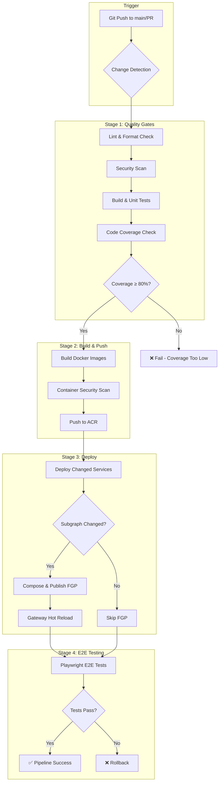
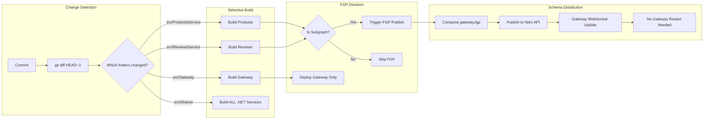
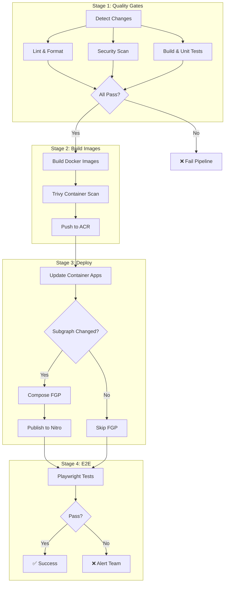
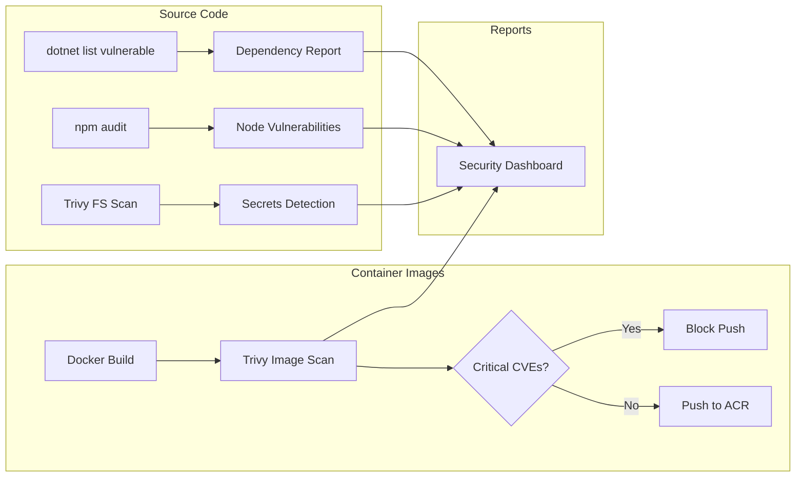
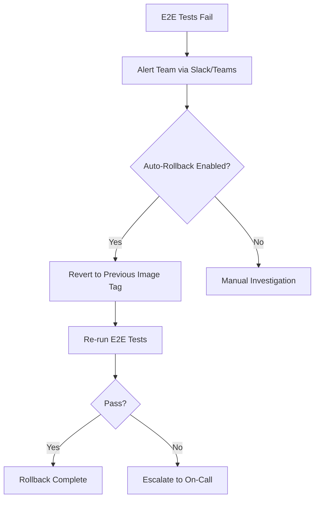

# CI/CD Pipeline Architecture

This document describes the complete CI/CD pipeline for the GraphQL Gateway project using **Azure DevOps YAML Pipelines** with a Git repository.

---

## Pipeline Overview



---

## Incremental Deployment Strategy

Only services with code changes are built and deployed. The pipeline uses `git diff` to detect changes.



---

## Tooling Stack

| Category | Tool | Purpose |
|----------|------|---------|
| **Linting** | `dotnet format` | C# code formatting |
| **Linting** | `ESLint` | TypeScript/JavaScript linting |
| **Security** | `Trivy` | Container & dependency scanning |
| **Security** | `dotnet-security-scan` | .NET vulnerability detection |
| **Security** | `npm audit` | Node.js dependency vulnerabilities |
| **Unit Tests** | `xUnit` | .NET unit testing |
| **Coverage** | `Coverlet` | Code coverage collection |
| **E2E Tests** | `Playwright` | Browser automation testing |
| **Quality Gate** | Custom thresholds | Coverage, security, lint checks |

---

## Azure DevOps Pipeline Definition

### `azure-pipelines.yml`

```yaml
trigger:
  branches:
    include:
      - main
  paths:
    include:
      - src/**
      - deployment/alderaan/**

pr:
  branches:
    include:
      - main

variables:
  - group: graphql-gateway-secrets  # Contains NITRO_ADMIN_TOKEN, ACR credentials
  - name: azureSubscription
    value: 'Your-Service-Connection'
  - name: resourceGroup
    value: 'rg-graphql-gateway-alderaan2'
  - name: acrName
    value: 'cralderaan2zu4x7n3b'
  - name: coverageThreshold
    value: 80

stages:
  # ═══════════════════════════════════════════════════════════════
  # STAGE 1: QUALITY GATES
  # ═══════════════════════════════════════════════════════════════
  - stage: QualityGates
    displayName: '🔍 Quality Gates'
    jobs:
      # ─────────────────────────────────────────────────────────────
      # Job: Detect Changes
      # ─────────────────────────────────────────────────────────────
      - job: DetectChanges
        displayName: 'Detect Changed Services'
        pool:
          vmImage: 'ubuntu-latest'
        steps:
          - checkout: self
            fetchDepth: 0

          - task: PowerShell@2
            name: Changes
            displayName: 'Analyze Git Diff'
            inputs:
              targetType: 'inline'
              pwsh: true
              script: |
                $changes = git diff --name-only HEAD~1 HEAD 2>$null
                if (-not $changes) {
                    $changes = git diff --name-only HEAD
                }
                
                Write-Host "Changed files:"
                $changes | ForEach-Object { Write-Host "  - $_" }
                
                # Service detection
                $services = @{
                    'products'         = @{ Path = 'src/ProductsService'; IsSubgraph = $true }
                    'reviews'          = @{ Path = 'src/ReviewsService'; IsSubgraph = $true }
                    'shipping'         = @{ Path = 'src/ShippingService'; IsSubgraph = $true }
                    'orders'           = @{ Path = 'src/OrdersService'; IsSubgraph = $true }
                    'gateway'          = @{ Path = 'src/Gateway'; IsSubgraph = $false }
                    'nitro-schema-api' = @{ Path = 'src/NitroSchemaApi'; IsSubgraph = $false }
                    'backoffice'       = @{ Path = 'src/BackOfficeService'; IsSubgraph = $false }
                    'frontend'         = @{ Path = 'src/frontend'; IsSubgraph = $false }
                }
                
                $sharedChanged = ($changes | Where-Object { $_ -like 'src/Shared/*' }).Count -gt 0
                $changedServices = @()
                $subgraphChanged = $false
                
                foreach ($svc in $services.GetEnumerator()) {
                    $svcChanged = ($changes | Where-Object { $_ -like "$($svc.Value.Path)/*" }).Count -gt 0
                    
                    if ($svcChanged -or ($sharedChanged -and $svc.Key -ne 'frontend')) {
                        $changedServices += $svc.Key
                        if ($svc.Value.IsSubgraph) { $subgraphChanged = $true }
                    }
                }
                
                $servicesJson = $changedServices | ConvertTo-Json -Compress
                if ($changedServices.Count -eq 0) { $servicesJson = '[]' }
                
                Write-Host "##vso[task.setvariable variable=changedServices;isOutput=true]$servicesJson"
                Write-Host "##vso[task.setvariable variable=subgraphChanged;isOutput=true]$subgraphChanged"
                Write-Host "##vso[task.setvariable variable=hasChanges;isOutput=true]$($changedServices.Count -gt 0)"
                
                Write-Host "`nChanged services: $servicesJson"
                Write-Host "Subgraph changed: $subgraphChanged"

      # ─────────────────────────────────────────────────────────────
      # Job: Lint & Format
      # ─────────────────────────────────────────────────────────────
      - job: Lint
        displayName: 'Lint & Format Check'
        pool:
          vmImage: 'ubuntu-latest'
        steps:
          - checkout: self

          - task: UseDotNet@2
            displayName: 'Setup .NET SDK'
            inputs:
              version: '9.0.x'

          - script: |
              dotnet format --verify-no-changes --verbosity diagnostic
            displayName: 'Check C# Formatting'
            workingDirectory: src

          - task: NodeTool@0
            displayName: 'Setup Node.js'
            inputs:
              versionSpec: '20.x'

          - script: |
              cd src/frontend
              npm ci
              npm run lint
            displayName: 'ESLint Frontend'
            continueOnError: false

      # ─────────────────────────────────────────────────────────────
      # Job: Security Scanning
      # ─────────────────────────────────────────────────────────────
      - job: Security
        displayName: 'Security Scan'
        pool:
          vmImage: 'ubuntu-latest'
        steps:
          - checkout: self

          - task: UseDotNet@2
            inputs:
              version: '9.0.x'

          # .NET Dependency Vulnerabilities
          - script: |
              dotnet list package --vulnerable --include-transitive 2>&1 | tee vulnerability-report.txt
              if grep -q "has the following vulnerable packages" vulnerability-report.txt; then
                echo "##vso[task.logissue type=warning]Vulnerable packages detected!"
                cat vulnerability-report.txt
              fi
            displayName: '.NET Vulnerability Scan'
            workingDirectory: src

          # Node.js Dependency Vulnerabilities
          - script: |
              cd src/frontend
              npm ci
              npm audit --audit-level=high
            displayName: 'NPM Audit'
            continueOnError: true  # Warning only, not blocking

          # Install Trivy
          - script: |
              curl -sfL https://raw.githubusercontent.com/aquasecurity/trivy/main/contrib/install.sh | sh -s -- -b /usr/local/bin v0.48.0
            displayName: 'Install Trivy'

          # Scan repository for secrets and vulnerabilities
          - script: |
              trivy fs --severity HIGH,CRITICAL --exit-code 1 --ignore-unfixed src/
            displayName: 'Trivy Filesystem Scan'

      # ─────────────────────────────────────────────────────────────
      # Job: Build & Unit Tests
      # ─────────────────────────────────────────────────────────────
      - job: BuildAndTest
        displayName: 'Build & Unit Tests'
        pool:
          vmImage: 'ubuntu-latest'
        steps:
          - checkout: self

          - task: UseDotNet@2
            inputs:
              version: '9.0.x'

          - script: dotnet restore
            displayName: 'Restore NuGet Packages'
            workingDirectory: src

          - script: dotnet build --no-restore --configuration Release
            displayName: 'Build Solution'
            workingDirectory: src

          - script: |
              dotnet test --no-build --configuration Release \
                --collect:"XPlat Code Coverage" \
                --results-directory $(Agent.TempDirectory)/TestResults \
                --logger "trx;LogFileName=test-results.trx" \
                -- DataCollectionRunSettings.DataCollectors.DataCollector.Configuration.Format=cobertura
            displayName: 'Run xUnit Tests with Coverage'
            workingDirectory: src

          - task: PublishTestResults@2
            displayName: 'Publish Test Results'
            inputs:
              testResultsFormat: 'VSTest'
              testResultsFiles: '$(Agent.TempDirectory)/TestResults/**/*.trx'
              mergeTestResults: true

          - task: PublishCodeCoverageResults@2
            displayName: 'Publish Code Coverage'
            inputs:
              summaryFileLocation: '$(Agent.TempDirectory)/TestResults/**/coverage.cobertura.xml'

          # Coverage Quality Gate
          - script: |
              # Install ReportGenerator for coverage analysis
              dotnet tool install -g dotnet-reportgenerator-globaltool
              
              # Generate coverage report and extract percentage
              reportgenerator \
                -reports:$(Agent.TempDirectory)/TestResults/**/coverage.cobertura.xml \
                -targetdir:$(Agent.TempDirectory)/CoverageReport \
                -reporttypes:TextSummary
              
              # Extract line coverage percentage
              COVERAGE=$(grep "Line coverage" $(Agent.TempDirectory)/CoverageReport/Summary.txt | grep -oP '\d+(\.\d+)?(?=%)')
              echo "Coverage: $COVERAGE%"
              
              # Check threshold
              if (( $(echo "$COVERAGE < $(coverageThreshold)" | bc -l) )); then
                echo "##vso[task.logissue type=error]Code coverage ($COVERAGE%) is below threshold ($(coverageThreshold)%)"
                exit 1
              fi
              
              echo "✅ Coverage ($COVERAGE%) meets threshold ($(coverageThreshold)%)"
            displayName: 'Coverage Quality Gate'

  # ═══════════════════════════════════════════════════════════════
  # STAGE 2: BUILD & PUSH IMAGES
  # ═══════════════════════════════════════════════════════════════
  - stage: BuildImages
    displayName: '🐳 Build & Push Images'
    dependsOn: QualityGates
    condition: |
      and(
        succeeded(),
        eq(dependencies.QualityGates.outputs['DetectChanges.Changes.hasChanges'], 'true')
      )
    variables:
      changedServices: $[ dependencies.QualityGates.outputs['DetectChanges.Changes.changedServices'] ]
    jobs:
      - job: BuildPush
        displayName: 'Build & Push Changed Services'
        pool:
          vmImage: 'ubuntu-latest'
        steps:
          - checkout: self

          - task: AzureCLI@2
            displayName: 'Login to ACR'
            inputs:
              azureSubscription: $(azureSubscription)
              scriptType: 'bash'
              scriptLocation: 'inlineScript'
              inlineScript: |
                az acr login --name $(acrName)

          - task: PowerShell@2
            displayName: 'Build Changed Services'
            inputs:
              targetType: 'inline'
              pwsh: true
              script: |
                $services = '$(changedServices)' | ConvertFrom-Json
                
                $serviceConfig = @{
                    'products'         = @{ Dockerfile = 'src/ProductsService/Dockerfile'; Context = 'src' }
                    'reviews'          = @{ Dockerfile = 'src/ReviewsService/Dockerfile'; Context = 'src' }
                    'shipping'         = @{ Dockerfile = 'src/ShippingService/Dockerfile'; Context = 'src' }
                    'orders'           = @{ Dockerfile = 'src/OrdersService/Dockerfile'; Context = 'src' }
                    'gateway'          = @{ Dockerfile = 'src/Gateway/Dockerfile'; Context = 'src' }
                    'nitro-schema-api' = @{ Dockerfile = 'src/NitroSchemaApi/Dockerfile'; Context = 'src' }
                    'backoffice'       = @{ Dockerfile = 'src/BackOfficeService/Dockerfile'; Context = 'src' }
                    'frontend'         = @{ Dockerfile = 'src/frontend/Dockerfile'; Context = 'src/frontend' }
                }
                
                foreach ($svc in $services) {
                    $config = $serviceConfig[$svc]
                    $image = "$(acrName).azurecr.io/graphql-gateway/${svc}"
                    $tag = "$(Build.SourceVersion)"
                    
                    Write-Host "Building $svc..."
                    docker build -f $config.Dockerfile -t "${image}:${tag}" -t "${image}:latest" $config.Context
                    
                    Write-Host "Scanning $svc for vulnerabilities..."
                    trivy image --severity HIGH,CRITICAL --exit-code 0 "${image}:${tag}"
                    
                    Write-Host "Pushing $svc..."
                    docker push "${image}:${tag}"
                    docker push "${image}:latest"
                }

  # ═══════════════════════════════════════════════════════════════
  # STAGE 3: DEPLOY TO ACA
  # ═══════════════════════════════════════════════════════════════
  - stage: Deploy
    displayName: '🚀 Deploy to Azure'
    dependsOn: 
      - QualityGates
      - BuildImages
    condition: succeeded()
    variables:
      changedServices: $[ dependencies.QualityGates.outputs['DetectChanges.Changes.changedServices'] ]
      subgraphChanged: $[ dependencies.QualityGates.outputs['DetectChanges.Changes.subgraphChanged'] ]
    jobs:
      - deployment: DeployServices
        displayName: 'Deploy Changed Services'
        pool:
          vmImage: 'ubuntu-latest'
        environment: 'production'
        strategy:
          runOnce:
            deploy:
              steps:
                - checkout: self

                - task: AzureCLI@2
                  displayName: 'Update Container Apps'
                  inputs:
                    azureSubscription: $(azureSubscription)
                    scriptType: 'pscore'
                    scriptLocation: 'inlineScript'
                    inlineScript: |
                      $services = '$(changedServices)' | ConvertFrom-Json
                      
                      foreach ($svc in $services) {
                          Write-Host "Deploying $svc..."
                          az containerapp update `
                              --name $svc `
                              --resource-group $(resourceGroup) `
                              --image "$(acrName).azurecr.io/graphql-gateway/${svc}:$(Build.SourceVersion)"
                      }

      - job: PublishFGP
        displayName: 'Publish FGP (if subgraph changed)'
        dependsOn: DeployServices
        condition: eq(variables['subgraphChanged'], 'true')
        pool:
          vmImage: 'ubuntu-latest'
        steps:
          - checkout: self

          - task: UseDotNet@2
            inputs:
              version: '9.0.x'

          - script: dotnet tool install -g HotChocolate.Fusion.CommandLine --prerelease
            displayName: 'Install Fusion CLI'

          - task: AzureCLI@2
            displayName: 'Compose and Publish FGP'
            inputs:
              azureSubscription: $(azureSubscription)
              scriptType: 'pscore'
              scriptLocation: 'scriptPath'
              scriptPath: 'src/compose-fgp.ps1'
              arguments: '-Environment aca -ResourceGroup $(resourceGroup)'
            env:
              NITRO_ADMIN_TOKEN: $(NITRO_ADMIN_TOKEN)

  # ═══════════════════════════════════════════════════════════════
  # STAGE 4: E2E TESTING
  # ═══════════════════════════════════════════════════════════════
  - stage: E2ETesting
    displayName: '🎭 E2E Tests'
    dependsOn: Deploy
    condition: succeeded()
    jobs:
      - job: Playwright
        displayName: 'Playwright E2E Tests'
        pool:
          vmImage: 'ubuntu-latest'
        steps:
          - checkout: self

          - task: NodeTool@0
            inputs:
              versionSpec: '20.x'

          - script: |
              cd src/frontend
              npm ci
              npx playwright install --with-deps chromium
            displayName: 'Install Playwright'

          - script: |
              cd src/frontend
              npx playwright test --reporter=junit --output-file=$(Agent.TempDirectory)/e2e-results.xml
            displayName: 'Run E2E Tests'
            env:
              GATEWAY_URL: https://gateway.alderaan2.azurecontainerapps.io/graphql
              FRONTEND_URL: https://frontend.alderaan2.azurecontainerapps.io

          - task: PublishTestResults@2
            displayName: 'Publish E2E Results'
            condition: always()
            inputs:
              testResultsFormat: 'JUnit'
              testResultsFiles: '$(Agent.TempDirectory)/e2e-results.xml'
              testRunTitle: 'Playwright E2E Tests'

          - task: PublishPipelineArtifact@1
            displayName: 'Publish Playwright Report'
            condition: always()
            inputs:
              targetPath: 'src/frontend/playwright-report'
              artifact: 'playwright-report'
```

---

## Stage Flow Diagram



---

## Service Change Matrix

This table shows what happens when each service changes:

| Service Changed | Build | Deploy | FGP Publish | Gateway Restart |
|-----------------|-------|--------|-------------|-----------------|
| `ProductsService` | ✅ | ✅ | ✅ | ❌ (hot reload) |
| `ReviewsService` | ✅ | ✅ | ✅ | ❌ (hot reload) |
| `ShippingService` | ✅ | ✅ | ✅ | ❌ (hot reload) |
| `OrdersService` | ✅ | ✅ | ✅ | ❌ (hot reload) |
| `Gateway` | ✅ | ✅ | ❌ | ✅ (code change) |
| `NitroSchemaApi` | ✅ | ✅ | ❌ | ❌ |
| `BackOfficeService` | ✅ | ✅ | ❌ | ❌ |
| `frontend` | ✅ | ✅ | ❌ | ❌ |
| `Shared/*` | All .NET | All .NET | If subgraph | Depends |

---

## Quality Gate Thresholds

| Metric | Threshold | Action on Failure |
|--------|-----------|-------------------|
| Code Coverage | ≥ 80% | ❌ Block pipeline |
| Lint Errors | 0 | ❌ Block pipeline |
| High/Critical Vulnerabilities | 0 | ⚠️ Warning (configurable) |
| E2E Test Pass Rate | 100% | ❌ Block pipeline |

---

## Security Scanning Pipeline



---

## Adding a New Service

When you add a new service (e.g., `InventoryService`):

1. **Create the service** in `src/InventoryService/`
2. **Add Dockerfile** following the existing pattern
3. **Update the change detection script** in `azure-pipelines.yml`:

```powershell
$services = @{
    # ... existing services ...
    'inventory' = @{ Path = 'src/InventoryService'; IsSubgraph = $true }
}
```

4. **Add subgraph config** in `src/subgraphs/inventory.subgraph` for FGP composition
5. **Push** - the pipeline handles everything else automatically

---

## Environment Variables & Secrets

Store these in Azure DevOps Library (Variable Group: `graphql-gateway-secrets`):

| Variable | Description | Secret |
|----------|-------------|--------|
| `NITRO_ADMIN_TOKEN` | Token for Nitro Schema API admin endpoints | ✅ |
| `AZURE_CREDENTIALS` | Service Principal credentials (if not using service connection) | ✅ |
| `ACR_USERNAME` | ACR admin username (optional if using managed identity) | ✅ |
| `ACR_PASSWORD` | ACR admin password (optional if using managed identity) | ✅ |

---

## Rollback Strategy

If E2E tests fail after deployment:



To enable auto-rollback, add this step after E2E failure:

```yaml
- task: AzureCLI@2
  displayName: 'Rollback on Failure'
  condition: failed()
  inputs:
    azureSubscription: $(azureSubscription)
    scriptType: 'bash'
    scriptLocation: 'inlineScript'
    inlineScript: |
      # Get previous revision and activate it
      for svc in $(echo '$(changedServices)' | jq -r '.[]'); do
        PREV_REVISION=$(az containerapp revision list \
          --name $svc \
          --resource-group $(resourceGroup) \
          --query "[1].name" -o tsv)
        
        az containerapp revision activate \
          --name $svc \
          --resource-group $(resourceGroup) \
          --revision $PREV_REVISION
      done
```
