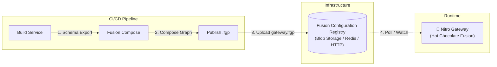

# Dynamic Fusion Gateway (Nitro) Integration Design

This document outlines the architecture and steps required to upgrade our current static Fusion Gateway to a **Dynamic "Nitro" Gateway** that supports live schema updates without downtime.

## 🎯 Objective
Enable a **Zero-Downtime Deployment** workflow where:
1.  Subgraphs (Products, Orders, etc.) can be deployed independently.
2.  Schema changes are automatically composed and pushed to the Gateway.
3.  The Gateway (running the Nitro engine) detects the new configuration and hot-reloads instantly.

## 🏗️ Architecture

We will transition from a "Build-Time Composition" (current) to a "Publish-Time Composition" model.



## 🛠️ Implementation Plan

### 1. The Registry (Configuration Store)
Instead of baking `gateway.fgp` into the Gateway's Docker image, we will store it externally.
*   **Local Dev**: A shared folder or watched file.
*   **Production**: Azure Blob Storage, AWS S3, or a Redis instance.

### 2. CI/CD Pipeline Updates
We need a pipeline that runs whenever a subgraph changes:

```bash
# 1. Install Fusion CLI
dotnet tool install -g HotChocolate.Fusion.CommandLine

# 2. Pack the modified subgraph (e.g., Orders)
dotnet fusion subgraph pack -w src -s schemas/orders.graphql -c schemas/orders-config.json -p schemas/orders.fsp

# 3. Re-compose the full Gateway package
dotnet fusion compose -p gateway.fgp -s schemas/*.fsp

# 4. Push/Upload the new gateway.fgp to the Registry
# (Example: Upload to Azure Blob Storage)
az storage blob upload -f gateway.fgp -c fusion-config -n gateway.fgp --overwrite
```

### 3. Gateway Configuration (Nitro)
Update the Gateway's `Program.cs` to load the configuration from the external source and watch for changes.

#### Option A: File Watcher (Simplest / Kubernetes Volume)
If using Kubernetes, you can mount the `.fgp` as a ConfigMap or Volume. The Gateway watches the file system.

```csharp
// src/Gateway/Program.cs
var builder = WebApplication.CreateBuilder(args);

builder.Services
    .AddFusionGatewayServer()
    .ConfigureFromFile("./config/gateway.fgp", watchFile: true); // 👈 Enables Hot Reload

var app = builder.Build();
app.MapGraphQL();
app.Run();
```

#### Option B: HTTP Polling / Blob Storage
For cloud-native setups, implement a `IConfiguration` source or use a background service to poll the blob storage and update the configuration.

```csharp
// src/Gateway/Program.cs
builder.Services
    .AddFusionGatewayServer()
    .ConfigureFromCloud(
        connectionString: builder.Configuration["Fusion:RegistryConnection"], 
        graphName: "my-graph",
        watch: true
    );
```
*(Note: `ConfigureFromCloud` would be part of the managed Bananacakepop platform or a custom implementation wrapping the `FusionGraphConfiguration`)*.

## 🚀 Deployment Strategy

1.  **Deploy Gateway**: Deploy the Gateway service once. It starts up and waits for a valid configuration.
2.  **Deploy Subgraph**: Deploy a new version of `OrdersService`.
3.  **Publish Schema**: The CI pipeline detects the change, re-composes, and overwrites `gateway.fgp` in the Registry.
4.  **Hot Reload**: The Gateway detects the change (via file watch or poll), creates a new execution engine in the background, and atomically swaps it. In-flight requests complete on the old version; new requests use the new version.

## ✅ Benefits
*   **Decoupling**: Subgraph teams can release independently.
*   **Resilience**: If composition fails, the Gateway keeps running the last known good configuration.
*   **Speed**: No need to restart the Gateway container/pod.

## 💻 Local Development Implementation

For local development, we have implemented a custom `FusionReloadService` that watches the `gateway.fgp` file for changes.

### How it works
1.  **FusionReloadService**: A `BackgroundService` that uses `FileSystemWatcher` to monitor `gateway.fgp`.
2.  **Event Handling**: When the file changes, the service waits briefly (debounce) to ensure the write is complete.
3.  **Eviction**: It calls `IRequestExecutorResolver.EvictRequestExecutor("Fusion")` to invalidate the current schema.
4.  **Reload**: The next request to the Gateway triggers a fresh load of the configuration from the file.

### Code Reference
-   `src/Gateway/FusionReloadService.cs`: The file watcher implementation.
-   `src/Gateway/Program.cs`: Registration of the hosted service.

```csharp
// src/Gateway/Program.cs
builder.Services.AddHostedService<Gateway.FusionReloadService>();
```
