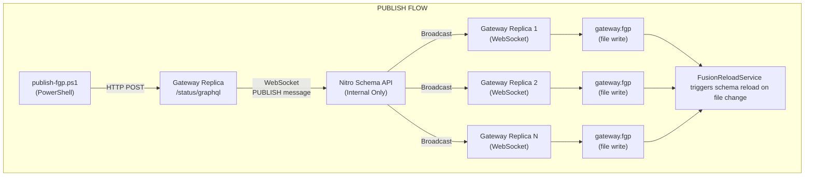
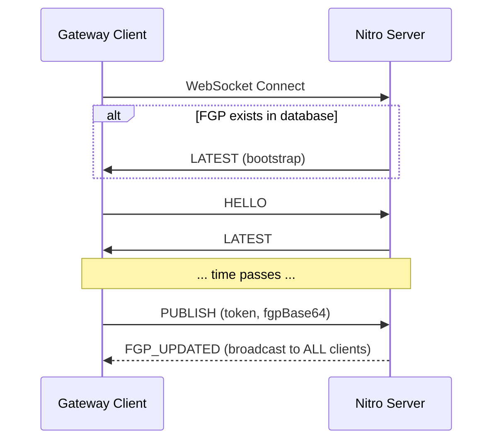
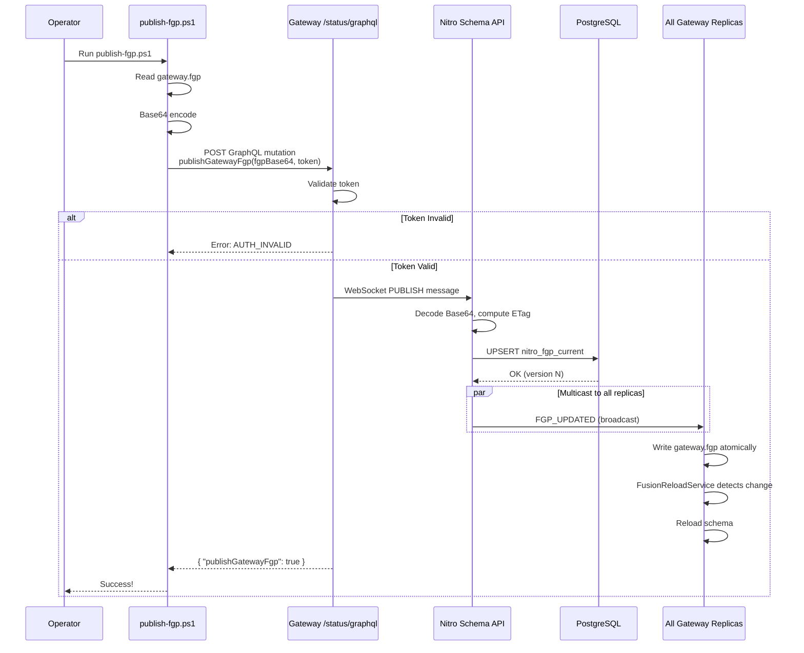
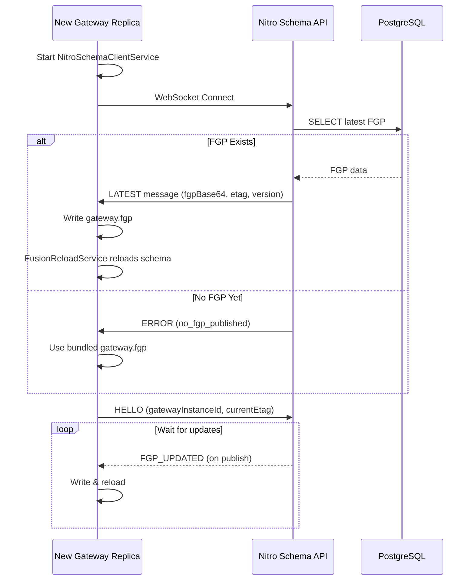
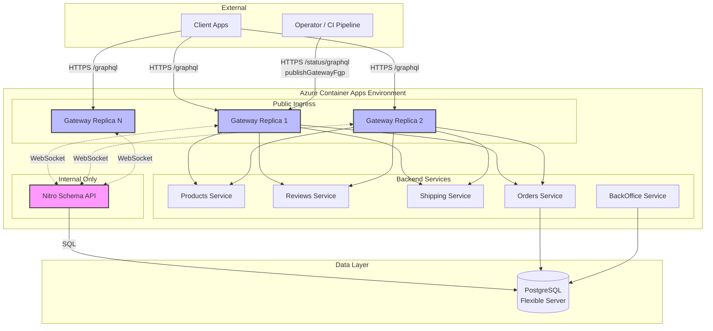
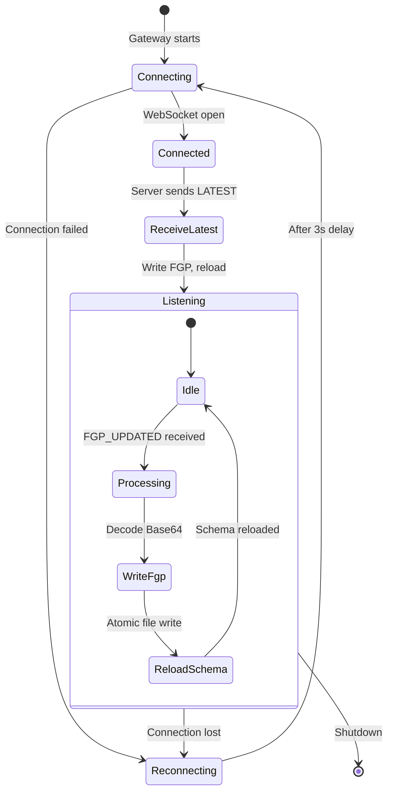
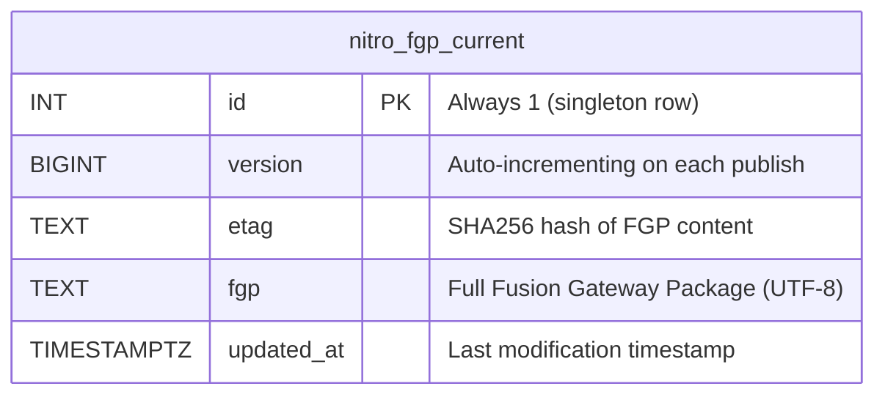
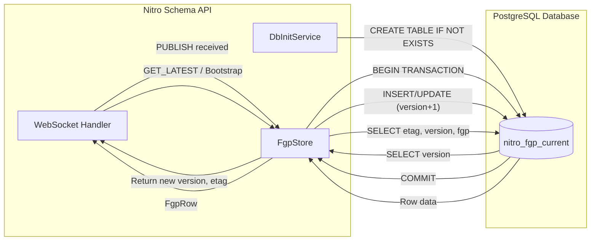
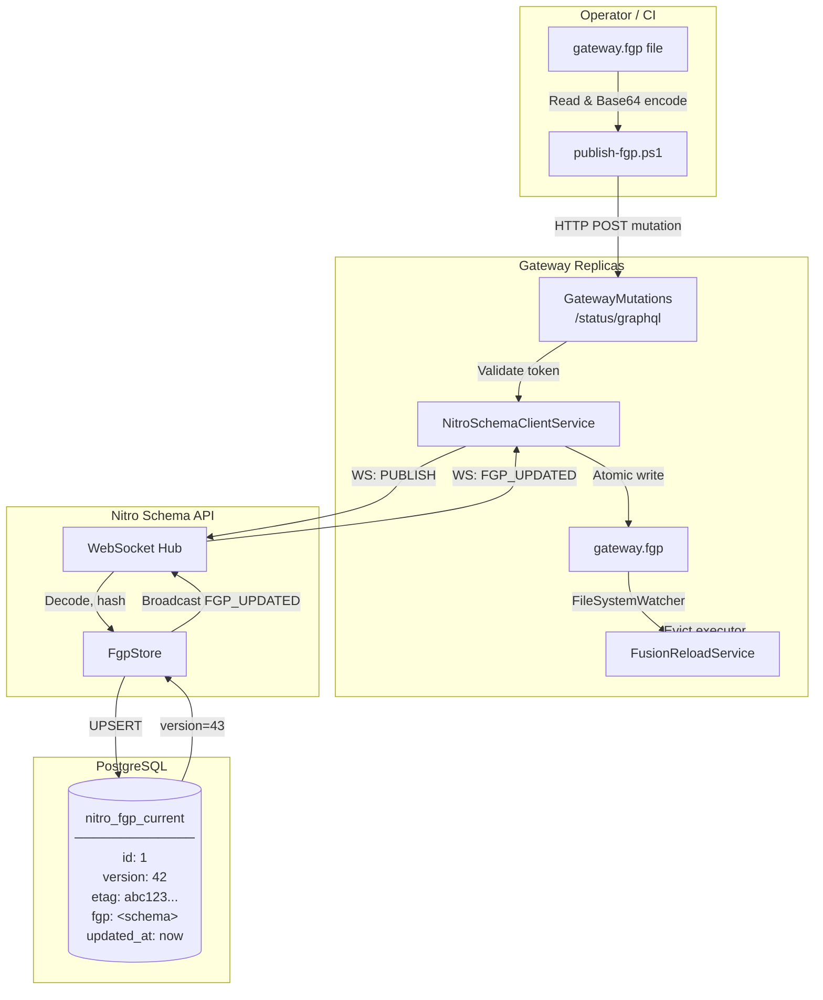

# Nitro Schema API

**Internal WebSocket-based schema distribution service for HotChocolate Fusion Gateway.**

Nitro Schema API enables **zero-downtime gateway schema updates** without container redeployment. When you publish a new `gateway.fgp` (Fusion Gateway Package), Nitro multicasts it to all connected gateway replicas in real-time.

---

## Table of Contents

- [Overview](#overview)
- [Architecture](#architecture)
- [WebSocket Protocol](#websocket-protocol)
- [Gateway Integration](#gateway-integration)
- [Publishing Tool](#publishing-tool)
- [Local Development](#local-development)
- [Azure Container Apps Deployment](#azure-container-apps-deployment)
- [Security](#security)
- [Diagrams](#diagrams)

---

## Overview

Traditional Fusion Gateway deployments require a container restart or redeployment whenever the composed schema (`gateway.fgp`) changes. Nitro Schema API solves this by:

1. **Storing** the latest FGP in PostgreSQL with version tracking
2. **Multicasting** updates to all connected gateways via WebSocket
3. **Bootstrapping** new gateway instances with the latest schema on connect
4. **Providing** a hidden mutation endpoint on the gateway for triggering publishes

### Key Benefits

- ✅ No gateway container redeployment needed for schema changes
- ✅ All replicas update simultaneously (multicast)
- ✅ New replicas automatically receive latest schema on startup
- ✅ Version tracking and ETag for change detection
- ✅ Token-based authentication for publish operations

---

## Architecture



### Components

| Component | Role |
|-----------|------|
| **Nitro Schema API** | Central WebSocket hub + PostgreSQL store for FGP |
| **Gateway** | Fusion gateway with `NitroSchemaClientService` (WS client) |
| **FusionReloadService** | Watches `gateway.fgp` file for changes, triggers schema reload |
| **GatewayMutations** | Hidden `/status/graphql` endpoint with `publishGatewayFgp` mutation |
| **publish-fgp.ps1** | PowerShell tool to trigger publish via gateway mutation |

---

## WebSocket Protocol

Nitro uses a simple JSON-over-WebSocket protocol. All messages are UTF-8 encoded JSON objects with a `type` field.

### Endpoint

```
ws://nitro-schema-api:8080/ws
```

### Message Types

#### Client → Server

| Type | Description | Fields |
|------|-------------|--------|
| `HELLO` | Initial handshake / request latest | `gatewayInstanceId`, `currentEtag` |
| `GET_LATEST` | Request current FGP | - |
| `PUBLISH` | Publish new FGP (requires auth) | `token`, `fgpBase64` |

#### Server → Client

| Type | Description | Fields |
|------|-------------|--------|
| `LATEST` | Response with current FGP | `etag`, `version`, `fgpBase64` |
| `FGP_UPDATED` | Broadcast when FGP changes | `etag`, `version`, `fgpBase64` |
| `ERROR` | Error response | `code` |

### Error Codes

| Code | Meaning |
|------|---------|
| `invalid_json` | Message was not valid JSON |
| `missing_type` | Message missing `type` field |
| `unknown_type` | Unrecognized message type |
| `no_fgp_published` | No FGP stored yet |
| `publishing_disabled` | Server has no admin token configured |
| `unauthorized` | Invalid or missing token for PUBLISH |
| `missing_fgp` | PUBLISH missing `fgpBase64` |
| `invalid_base64` | `fgpBase64` is not valid Base64 |
| `db_unavailable` | PostgreSQL connection failed |

### Example Message Flow



---

## Gateway Integration

The Gateway includes two key components for Nitro integration:

### 1. NitroSchemaClientService

A `BackgroundService` that maintains a persistent WebSocket connection to Nitro.

**Responsibilities:**
- Connect to Nitro on startup (with retry/backoff on failure)
- Receive `LATEST` on connect (bootstrap with current schema)
- Listen for `FGP_UPDATED` broadcasts
- Atomically write received FGP to `gateway.fgp` file
- Implement `INitroSchemaPublisher` interface for sending `PUBLISH` messages

**Configuration:**

| Environment Variable | Description |
|---------------------|-------------|
| `NITRO_SCHEMA_WS` | WebSocket URL, e.g., `ws://nitro-schema-api:8080/ws` |
| `NITRO_ADMIN_TOKEN` | Token for authenticating PUBLISH requests |

### 2. GatewayMutations

Exposes a hidden GraphQL mutation on the `/status/graphql` endpoint:

```graphql
type Mutation {
  publishGatewayFgp(fgpBase64: String!, token: String!): Boolean!
}
```

**Security:** The mutation validates `token` against `NITRO_ADMIN_TOKEN` using constant-time comparison before relaying to Nitro.

### 3. FusionReloadService

Watches the `gateway.fgp` file for changes using `FileSystemWatcher`. When the file changes:

1. Evicts the current GraphQL request executor
2. HotChocolate reloads the schema from the new FGP
3. Publishes a `GatewayReloaded` subscription event

---

## Publishing Tools

### compose-fgp.ps1 (Recommended)

Composes a fresh `gateway.fgp` with correct service URLs for the target environment and optionally publishes it.

**Location:** `src/compose-fgp.ps1`

**Features:**
- Automatically detects correct service URLs based on environment
- For `local`: Uses Docker Compose internal DNS (`http://products:8080/graphql`)
- For `aca`: Queries Azure Container Apps API to get actual FQDNs
- Uses HotChocolate Fusion CLI to pack and compose
- Optionally publishes to all gateway replicas via Nitro

**Usage:**

```powershell
# Compose for local Docker Compose and publish
.\compose-fgp.ps1 -Environment local

# Compose for Azure Container Apps and publish
.\compose-fgp.ps1 -Environment aca -ResourceGroup alderaan

# Just compose, don't publish
.\compose-fgp.ps1 -Environment local -SkipPublish

# Compose for ACA with custom token
.\compose-fgp.ps1 -Environment aca -ResourceGroup alderaan -Token "my-secret-token"
```

**Parameters:**

| Parameter | Default | Description |
|-----------|---------|-------------|
| `-Environment` | (required) | `local` or `aca` |
| `-ResourceGroup` | `alderaan` | Azure resource group (for `aca`) |
| `-GatewayUrl` | auto-detected | Override gateway publish endpoint |
| `-Token` | `dev-token` | Admin token for authentication |
| `-SkipPublish` | `$false` | Only compose, don't publish |
| `-OutputPath` | `Gateway/gateway.fgp` | Custom output path |

**Example Output:**

```
======================================
  Fusion Gateway Package Composer
======================================

Environment:  local
Output:       C:\src\Gateway\gateway.fgp

Step 1: Building subgraph packages...
  [Products]
    URL: http://products:8080/graphql
    Packing...
    Created: Products.fsp
  ...

Step 2: Composing gateway.fgp...
  Created: C:\src\Gateway\gateway.fgp
  Size: 58340 bytes

Step 3: Publishing to gateway...
  Endpoint: http://localhost:5000/status/graphql
  Publish request accepted.

Done!
```

### publish-fgp.ps1

Low-level script to publish an existing `gateway.fgp` file without recomposing.

**Location:** `src/publish-fgp.ps1`

**Usage:**

```powershell
# Default: reads Gateway/gateway.fgp, posts to http://localhost:5000/status/graphql
.\publish-fgp.ps1

# Specify custom endpoint and token
.\publish-fgp.ps1 -GatewayGraphQlUrl "https://gateway.example.com/status/graphql" -Token "your-secret-token"

# Specify custom FGP file
.\publish-fgp.ps1 -FgpPath "C:\path\to\custom.fgp"
```

**Parameters:**

| Parameter | Default | Description |
|-----------|---------|-------------|
| `-FgpPath` | `Gateway/gateway.fgp` | Path to FGP file to publish |
| `-GatewayGraphQlUrl` | `http://localhost:5000/status/graphql` | Gateway status endpoint URL |
| `-Token` | `dev-token` | Admin token for authentication |

**Example Output:**

```
Publishing 58810 bytes to http://localhost:5000/status/graphql
Publish request accepted.
{
    "data":  {
                 "publishGatewayFgp":  true
             }
}
```

### Workflow

```mermaid
flowchart LR
    subgraph ComposeFgp["compose-fgp.ps1"]
        Detect["Detect Environment"]
        GetURLs["Get Service URLs"]
        Pack["Pack Subgraphs"]
        Compose["Compose FGP"]
    end
    
    subgraph PublishFgp["publish-fgp.ps1"]
        Read["Read FGP"]
        Encode["Base64 Encode"]
        Post["HTTP POST Mutation"]
    end
    
    Detect --> GetURLs
    GetURLs -->|"local: Docker DNS<br/>aca: Azure CLI"| Pack
    Pack -->|"fusion subgraph pack"| Compose
    Compose -->|"fusion compose"| Read
    
    Read --> Encode
    Encode --> Post
    Post -->|"/status/graphql"| Gateway
    
    Gateway["Gateway"] -->|"WebSocket"| Nitro["Nitro"]
    Nitro -->|"Broadcast"| AllGateways["All Replicas"]
```



1. **Compose** (compose-fgp.ps1):
   - Detect environment (local vs ACA)
   - Get correct URLs for each subgraph
   - Pack subgraphs with Fusion CLI
   - Compose gateway.fgp

2. **Publish** (publish-fgp.ps1 or compose-fgp.ps1):
   - Read `gateway.fgp` file
   - Base64 encode the content
   - Send GraphQL mutation to gateway `/status/graphql`
   - Gateway validates token and relays to Nitro via WebSocket
   - Nitro stores in PostgreSQL and broadcasts to all connected gateways
   - Each gateway writes the file and reloads schema

---

## Local Development

### Prerequisites

- Docker Desktop
- PowerShell
- .NET 10 Preview SDK
- HotChocolate Fusion CLI (`dotnet tool install -g HotChocolate.Fusion.CommandLine --prerelease`)

### Running Locally

```powershell
cd src
docker compose up -d --build
```

This starts:
- `postgres` - Database for Nitro and Wolverine
- `nitro-schema-api` - WebSocket hub on port 8080 (internal)
- `gateway` - Fusion gateway on port 5000
- Microservices (products, reviews, shipping, orders, backoffice)

### Testing the Publish Flow

```powershell
cd src
.\compose-fgp.ps1 -Environment local
```

Or if you just want to publish an existing FGP:

```powershell
cd src
.\publish-fgp.ps1
```

### Viewing Logs

```powershell
docker compose logs -f nitro-schema-api
docker compose logs -f gateway
```

### Expected Log Output

**Nitro:**
```
info: DbInitService[0] Ensured nitro_fgp_current table exists
info: Microsoft.AspNetCore.Hosting.Diagnostics[1] Request starting HTTP/1.1 GET http://nitro-schema-api:8080/ws
```

**Gateway:**
```
info: Gateway.NitroSchemaClientService[0] Connecting to Nitro at ws://nitro-schema-api:8080/ws
info: Gateway.NitroSchemaClientService[0] Updated gateway.fgp from Nitro
info: Gateway.FusionReloadService[0] gateway.fgp changed, reloading schema...
```

---

## Azure Container Apps Deployment

### Nitro as Internal Service

Nitro should be deployed as an **internal-only** container app (no external ingress):

```powershell
az containerapp create `
  --name nitro-schema-api `
  --resource-group $rg `
  --environment $envId `
  --image "$acr.azurecr.io/nitro-schema-api:latest" `
  --ingress internal `
  --target-port 8080 `
  --min-replicas 1 `
  --max-replicas 1 `
  --env-vars `
    "ASPNETCORE_ENVIRONMENT=Production" `
    "ConnectionStrings__postgres=..." `
    "NITRO_ADMIN_TOKEN=secretref:nitro-admin-token" `
  --secrets "nitro-admin-token=$adminToken"
```

### Gateway Configuration

```powershell
--env-vars `
  "NITRO_SCHEMA_WS=ws://nitro-schema-api.internal.<env-domain>/ws" `
  "NITRO_ADMIN_TOKEN=secretref:nitro-admin-token"
```

### Publishing to ACA

```powershell
.\publish-fgp.ps1 `
  -Endpoint "https://gateway.<env-domain>/status/graphql" `
  -Token $adminToken
```

---

## Security

### Token Authentication

- The `NITRO_ADMIN_TOKEN` must be set on both Nitro and Gateway
- All `PUBLISH` requests require this token
- Token comparison uses constant-time algorithm to prevent timing attacks
- In ACA, store as a container app secret

### Network Isolation

- Nitro should be **internal-only** (no external ingress)
- Only gateway replicas within the same Container Apps environment can reach Nitro
- The `/status/graphql` endpoint on Gateway is external but mutation requires valid token

### Recommendations

1. Use a strong, randomly generated token (32+ characters)
2. Rotate tokens periodically via secret update
3. Consider IP restrictions on gateway `/status/graphql` if possible
4. Monitor publish events via Log Analytics

---

## Diagrams

### Activity Diagram: Publish Flow



### Activity Diagram: Gateway Startup



### Infrastructure Topology



### WebSocket Message Flow



### Data Schema (PostgreSQL ERD)



### PostgreSQL Data Flow



### Complete System Data Flow



---

## Database Schema

Nitro stores the current FGP in a single-row PostgreSQL table:

```sql
CREATE TABLE IF NOT EXISTS nitro_fgp_current (
  id          INT PRIMARY KEY,       -- Always 1 (single row)
  version     BIGINT NOT NULL,       -- Incrementing version number
  etag        TEXT NOT NULL,         -- SHA256 hash of FGP content
  fgp         TEXT NOT NULL,         -- Full FGP content (UTF-8)
  updated_at  TIMESTAMPTZ NOT NULL   -- Last update timestamp
);
```

### Column Details

| Column | Type | Description |
|--------|------|-------------|
| `id` | `INT` | Primary key, always `1` (singleton pattern) |
| `version` | `BIGINT` | Monotonically increasing on each publish |
| `etag` | `TEXT` | SHA256 hash (lowercase hex) for change detection |
| `fgp` | `TEXT` | Complete Fusion Gateway Package content |
| `updated_at` | `TIMESTAMPTZ` | UTC timestamp of last update |

### PostgreSQL Connection

Nitro connects via Npgsql using the `ConnectionStrings__postgres` environment variable:

```
Host=postgres;Port=5432;Database=orders;Username=postgres;Password=postgres
```

For Azure, use Azure Database for PostgreSQL Flexible Server with private endpoint:

```
Host=pgserver.private.postgres.database.azure.com;Port=5432;Database=orders;Username=pgadmin;Password=...;SSL Mode=Require
```

**Notes:**
- Only one row exists (id=1)
- Version increments on each publish
- ETag enables clients to detect if they already have latest
- FGP is stored as text (Fusion packages are human-readable)
- DbInitService creates table on startup with retry logic for Postgres availability

---

## Troubleshooting

### Gateway can't connect to Nitro

**Symptoms:** Gateway logs show `WebSocketException: Unable to connect`

**Causes:**
- Nitro container not running or crashed
- Incorrect `NITRO_SCHEMA_WS` URL
- Network policy blocking internal traffic

**Solutions:**
1. Check Nitro container status: `docker compose logs nitro-schema-api`
2. Verify URL format: `ws://nitro-schema-api:8080/ws` (not `wss://` unless TLS configured)
3. Ensure both services are in same Docker network / ACA environment

### Publish returns NITRO_UNAVAILABLE

**Symptoms:** Mutation returns `"Nitro is not connected: Nitro WS is not connected"`

**Causes:**
- Gateway's WebSocket to Nitro is not established
- Nitro crashed after gateway started

**Solutions:**
1. Check gateway logs for connection status
2. Restart Nitro container
3. Wait for gateway to reconnect (automatic retry every 3s)

### FGP not updating after publish

**Symptoms:** Publish succeeds but schema doesn't change

**Causes:**
- File watcher not triggering
- FGP content identical (same ETag)
- Error during schema reload

**Solutions:**
1. Check gateway logs for `Updated gateway.fgp from Nitro`
2. Check for `gateway.fgp changed, reloading schema...`
3. Verify FGP content actually changed

### DB connection errors in Nitro

**Symptoms:** Nitro logs show `NpgsqlException: Failed to connect`

**Causes:**
- PostgreSQL not ready when Nitro starts
- Incorrect connection string
- Network/firewall issues

**Solutions:**
1. Nitro has built-in retry with exponential backoff (up to 10s)
2. Check `ConnectionStrings__postgres` environment variable
3. Verify PostgreSQL is accepting connections

---

## API Reference

### Environment Variables

#### Nitro Schema API

| Variable | Required | Description |
|----------|----------|-------------|
| `ConnectionStrings__postgres` | ✅ | PostgreSQL connection string |
| `NITRO_ADMIN_TOKEN` | ✅ | Token for authenticating PUBLISH |
| `ASPNETCORE_URLS` | ❌ | Listen URL (default: `http://+:8080`) |

#### Gateway

| Variable | Required | Description |
|----------|----------|-------------|
| `NITRO_SCHEMA_WS` | ❌ | Nitro WebSocket URL (if not set, feature disabled) |
| `NITRO_ADMIN_TOKEN` | ❌ | Token for PUBLISH relay (required if WS configured) |

### HTTP Endpoints

#### Nitro Schema API

| Method | Path | Description |
|--------|------|-------------|
| GET | `/` | Health check, returns `{ "name": "nitro-schema-api", "status": "running" }` |
| GET | `/ws` | WebSocket upgrade endpoint |

#### Gateway (Status Schema)

| Method | Path | Description |
|--------|------|-------------|
| POST | `/status/graphql` | GraphQL endpoint with `publishGatewayFgp` mutation |

---

## License

Internal component of the GraphQL Gateway Patterns reference architecture.
